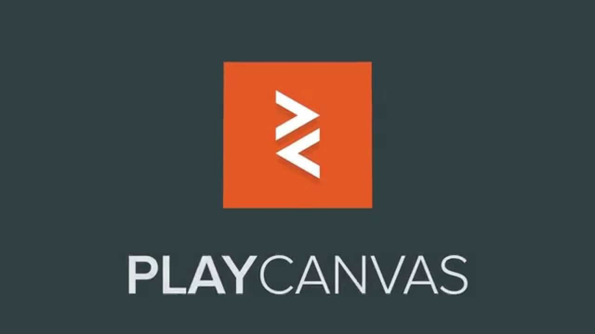{width="6.276097987751531in"
height="3.5342147856517934in"}

> PlayCanvas nieoficjalnie
>
> tylko o PlayCanvas, czyli książka w 100 stronach
>
> Autor: bunnymq
>
> Spis treści

**Część** **I** **-** **ogólnie** **4** Rozdział 1 PlayCanvas, cechy 5

> 1.1 PlayCanvas - co to? 5 1.2 cechy (features) 6
>
> Rozdział 2
>
> zasoby (assets) 10
>
> 2.1 materiał 11 2.2 tekstura 12 2.3 model 13 2.4 animacja 13 2.5
> tekstura sześcienna (cubemap) 14 2.6 HTML 14 2.7 audio 15 2.8 CSS 15
> 2.9 shader 16 2.10 font 17 2.11 duszek (sprite) 17 2.12 prefab (w pc
> pod nazwą template) 17

**Część** **II** **-** **edytor** **18**

> Rozdział 3
>
> UI 19
>
> 3.1 Panel hierarchia 20 3.2 Panel Zasoby 27 3.3 Panel inspektor 27 3.4
> Panel Menu 30 3.5 Panel Toolbar 31 3.6 Viewport 32

**Część** **III** **-** **silnik** **35**

> Rozdział 4
>
> skrypty 36
>
> 3.1 inicjalizacja i aktualizowanie 37 3.2 atrybuty aka
> attributes.add() 37 3.3 Komunikacja - zdarzenia 40
>
> Rozdział 5
>
> Grafika 44
>
> 5.1 Kamera 45 5.2 Oświetlenie 46 5.3 PBR 48
>
> Rozdział 6
>
> API omówienie 52
>
> 6.1 Application 53 6.2 GraphNode i Entity 53 6.2.2 Entity 54

**Część** **IV** **-** **Encja** **-** **obiekt** **gry** **59**

> Rozdział 7
>
> Encja, Komponenty
>
> i Systemy 60

**Część** **V** **-** **przykłady** **72**

> Rozdział 8
>
> PlayCanvas - przykłady 73
>
> 8.1 After the Flood 74 8.2 Casino 78

**Dodatek** **A** **90**

**API** **90**

**Dodatek** **B** **98**

**PlayCanvas** **przykłady** **98**

> 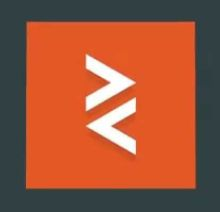{width="2.2935903324584426in"
> height="2.2101870078740156in"}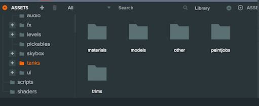{width="4.535054680664917in"
> height="2.1789107611548557in"}Część I - ogólnie
>
> Rozdział 1
>
> PlayCanvas, cechy
>
> 1.1 PlayCanvas - co to?
>
> Silnik gier stworzony w WebGL, nie bazuje, nie korzysta z biblioteki
> 3D threejs,

**został** **napisany** **od** **zera,** też jako platforma w chmurze do
tworzenia gier, wizualizacji,

konfiguratorów produktów (np. konfigurator samochodu). Można w nim
zrobić bardzo zaawansowaną grafikę, dzięki możliwościom silnika.

Ma on zintegrowany silnik fizyki Ammo. Z PlayCanvas można korzystać jako
z platformy z użyciem edytora graficznego i edytora kodu w chmurze lub
jako engine-only, czyli mając projekt lokalnie na swoim laptopie i
korzystając tylko z silnika w wybranym IDE lub edytorze kodu (VS Code,
Atom, Sublime Text), coś jak jest to realizowane w three.js.

Z engine-only jest jedna zaleta możesz korzystać z gita i wrzucać na
githuba, w przypadku platformy musisz korzystać z PlayCanvas'owego
systemu kontroli wersji i checkpointów, a nie commitów jak to działa w
git.

Nazwa przypomina trochę jakby to miało chodzić o klasyczny canvas,
HTML5, czyli 2D, ale jednak jest to bogaty silnik 3D, podobny silnik do
PlayCanvas to Babylon.js, też warty spróbowania, a PlayCanvas polecam
naprawdę fajny silnik, ale szczerze dopiero od niedawna była wcześniej
jedna wada, był limit miejsca na zasoby 100 MB jeżeli korzystałeś z
platformy. Teraz limit ten jest 1GB, czyli możesz trzymać zasoby na
platformie za darmo jeśli razem nie przekraczają 1 GB, żeby np. mieć 10
GB lub więcej musisz mieć wykupioną miesięczną subskrypcję.

Społeczność nie jest mała, dokumentacja jest dobrze napisana, tylko jest
jedna wada nie ma na ten temat książek ani po angielsku ani po polsku.

W przypadku problemów możesz znaleźć post dotyczący twojego problemu lub
możesz zapytać na forum tworząc nowy post. Nie jest tak że nikt nie
odpowiada na twoje pytanie,

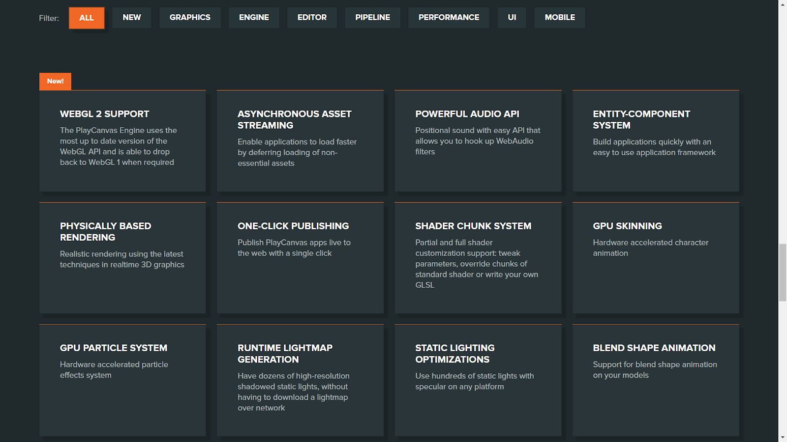{width="6.276097987751531in"
height="3.5342147856517934in"}

bardzo szybko dostajesz odpowiedź, a nawet możliwe rozwiązanie problemu,
co jest bardzo mocną zaletą forum PlayCanvas. Link do forum podaję tu
[[PlayCanvas Discussion]{.underline}](https://forum.playcanvas.com/)

Z ciekawości przeglądałem kod silnika, jest on naprawdę duży, chociaż
nie aż tak ogromny

jak to jest w przypadku Unreal Engine.

> 1.2 cechy (features)
>
> PlayCanvas posiada następujące cechy:
>
> 1\. wsparcie WebGL 2
>
> 2\. asynchroniczne streamowanie zasobów 3. audio API
>
> 4\. ECS (Entity Component System) - o tym w części Encja 5.
> renderowanie oparte o fizykę (PBR)
>
> 6\. system shader chunk 7. skinning GPU
>
> 8\. system cząsteczek GPU
>
> 9\. generowanie mapy świateł w czasie rzeczywistym 10. animacja
> mieszania kształtu
>
> 11\. miękkie cienie i light cookie 12. importer zasobów i menedźer
>
> 13\. potok graficzny liniowy i HDR 14. API urządzeń wejścia
>
> 15\. renderer fontu SDF
>
> 16\. silnik fizyki dotyczący rigidbody
>
> 17\. narzędzia dla responsywnych interfejsów 18. wsparcie WebVR
>
> 19\. rozwój i testowanie na urządzeniu mobilnym 20. filtrowanie
> zasobów
>
> 21\. edytowanie scen w czasie rzeczywistym 22. prefiltering tekstury
> sześciennej
>
> 23\. profiler
>
> 24\. kompresja tekstur (DXT, PVR i ETC1) 25. edytor materiału
>
> 26\. wieloplatformowość
>
> **1.** **wsparcie** **WebGL** **2**
>
> Silnik używa najnowsze WebGL API, ale jest wstecznie kompatybilny z
> WebGL wersji pierwszej.
>
> **2.** **asynchroniczne** **streamowanie** **zasobów**
>
> Asynchroniczne, a więc co za tym idzie szybsze ładowanie się
> aplikacji, poprzez opóźnienie ładowania mniej ważnych zasobów.
>
> **3.** **audio** **API**
>
> Pozycyjny dźwięk pozwala na przyczepianie filtrów WebAudio. **4.**
> **ECS** **(Entity** **Component** **System)** **-** **o** **tym**
> **w** **części** **Encja**
>
> Twórz aplikacje szybko z wykorzystaniem ECS. **5.** **renderowanie**
> **oparte** **o** **fizykę** **(PBR)**
>
> Zapewnij realizm w renderingu z użyciem najnowszych technik czasu
> rzeczywistego w grafice 3D
>
> **6.** **system** **shader** **chunk**
>
> Częściowa i pełna customizacja shaderów: dostosuj parametry, nadpisuj
> kawałki standardowego shadera lub pisz swój kod GLSL
>
> **7.** **skinning** **GPU**
>
> Przyspieszana sprzętowo animacji postaci **8.** **system**
> **cząsteczek** **GPU**
>
> Przyspieszany sprzętowo system cząsteczek
>
> **9.** **generowanie** **mapy** **świateł** **w** **czasie**
> **rzeczywistym**
>
> Możesz mieć wiele statycznych świateł wysokiej rozdzielczości **10.**
> **animacja** **mieszania** **kształtu**
>
> Wsparcie dla animacji mieszania kształtu modeli
>
> **11.** **miękkie** **cienie** **i** **light** **cookie**
>
> Wybieraj spośród wielu algorytmów cieni.
>
> Light cookies zapewniają fajne efekty tanim kosztem wydajnościowym
> **12.** **importer** **zasobów** **i** **menedźer**
>
> Importuj zasoby: modele 3D i animacje (FBX, OBJ, DAE, 3DS), tekstury i
> tekstury HDR, pliki audio i inne
>
> **13.** **potok** **graficzny** **liniowy** **i** **HDR**
>
> potok graficzny liniowy i HDR: korekcja gammy, tonemapping, wsparcie
> dla tekstur sześciennych HDR i mapy świateł
>
> **14.** **API** **urządzeń** **wejścia**
>
> Wsparcie klawiatury, myszy, gamepada, ekranów dotykowych **15.**
> **renderer** **fontu** **SDF**
>
> Konwertuj TTF, OTF na zasoby fontu (podobnie jak w Unity) **16.**
> **silnik** **fizyki** **rigidbody**
>
> Wbudowany w PlayCanvas system fizyki Ammo, który jest portem Bulleta,
> pozwala na łatwiejszą implementację fizyki w grze
>
> **17.** **narzędzia** **dla** **responsywnych** **interfejsów**
>
> Komponenty pozwalające na tworzenie responsywnych interfejsów 2D i 3D
> **18.** **wsparcie** **WebVR**
>
> Wsparcie dla najnowszych standardów WebVR **19.** **rozwój** **i**
> **testowanie** **na** **urządzeniu** **mobilnym**
>
> Szybkie iteracje z użyciem aktualizacji na bieżąco na urządzeniu
> mobilnym **20.** **filtrowanie** **zasobów**
>
> Przeszukuj i filtruj swoją kolekcję zasobów **21.** **edytowanie**
> **scen** **w** **czasie** **rzeczywistym**
>
> Zmiany na bieżąco w stylu kolaboracji z Google Docs **22.**
> **prefiltering** **tekstury** **sześciennej**
>
> Ustaw oświetlenie bazujące na obrazie (IBL) z użyciem tylko jednego
> kliknięcia przycisku
>
> **23.** **profiler**
>
> Wyświetla wykresy, statystyki związane z wydajnością w czasie
> rzeczywistym **24.** **kompresja** **tekstur** **(DXT,** **PVR** **i**
> **ETC1)**
>
> kompresja tekstur jednym kliknięciem **25.** **edytor** **materiału**
>
> Szybko dostosowywuj widoczne wizualnie zmiany w parametrach materiałów
> z wykorzystaniem edytora
>
> **26.** **wieloplatformowość**
>
> Uruchom edytor na każdym urządzeniu: desktop, laptop, tablet, smartfon
>
> Jak widzisz PlayCanvas posiada wiele funkcjonalności.
>
> Przejdę teraz do omówienia zasobów.

{width="5.327385170603675in"
height="2.1789107611548557in"}

> Rozdział 2 zasoby (assets)
>
> Zasoby mogą być różnego typu np. model, animacja, obrazki dla tekstur

(.png,.jpg) i audio.

> Poniżej omawiam wszystkie rodzaje zasobów dostępne w PlayCanvas:
>
> ● materiał
>
> ● Phonga
>
> ● fizyczny (physical) ● tekstura
>
> ● model
>
> ● animacja
>
> ● tekstura sześcienna (cubemap) ● HTML
>
> ● audio ● CSS ● shader

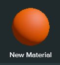{width="1.282325021872266in"
height="1.3865791776027996in"}

> ● font
>
> ● duszek (sprite)
>
> ● prefab (w pc pod nazwą template)
>
> ● moduł Wasm (Wasm module, WebAssembly module)

2.1 materiał

> Ogólnie materiał definiuje właściwości powierzchni takie jak kolor,
> połyskliwość itd.

Dokładnie czego to dotyczy odsyłam do podręczników z grafiki
komputerowej. W PlayCanvas materiał to jeden z typu zasobów.

Ma 2 podtypy: Phonga i fizyczny.

> **Phonga**

Model cieniowania Phonga to przestarzały element, zaleca się korzystania
z modelu fizycznego.

Więcej na temat modelu cieniowania Phonga możesz znaleźć tutaj [[Phong
Material \|
Learn]{.underline}](https://developer.playcanvas.com/en/user-manual/assets/phong-material/)
[[PlayCanvas]{.underline}](https://developer.playcanvas.com/en/user-manual/assets/phong-material/)

> **fizyczny** **(physical)**

Materiał fizyczny reprezentuje zaawansowany model cieniowania wysokiej
jakości, dlatego jest zalecany w stosowaniu dla uzyskania imponujących
efektów.

Szczegółowe info na temat właściwości materiału fizycznego dostępne jest
tutaj [[Physical Material \| Learn
PlayCanvas]{.underline}](https://developer.playcanvas.com/en/user-manual/assets/physical-material/)

Następujące regiony dotyczące tego materiału: **offset** **i**
**tiling**, **ambient** (związane z ambient

occlussion, okluzją otoczenia), **diffuse** (rozproszenie, diffuse to
inaczej albedo), **specular**

(daje połyskliwość), **emissive** (emituje światło), **opacity**
(przezroczystość), **normals**

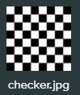{width="1.0321150481189851in"
height="1.2301990376202974in"}

(związane z mapą normalną), **parallax** (związane z mapa wysokościową),
**environment** (refleksy), **lightmap** (mapa świateł),

2.2 tekstura

Tekstura to obraz, który może zostać przypisany do materiału.

Poniżej wyróżniłem mapy tekstur, które przydaja się przy
multiteksturowaniu, aby uzyskać bardziej szczególowy wygląd materiału.

Rodzaje map tekstur: okluzja otoczenia (ambient occlusion, AO map),
tekstura sześcienna (cubemap), środowiskowa (env map), rozproszenia
(diffuse map), odbicia (specular map), emissive (emissive map),
przezroczystości (opacity map), normalna (normal map), wysokościowa
(height map), oświetlenia (light map).

Więcej o teksturach tutaj [[Textures \| Learn
PlayCanvas]{.underline}](https://developer.playcanvas.com/en/user-manual/assets/textures/)

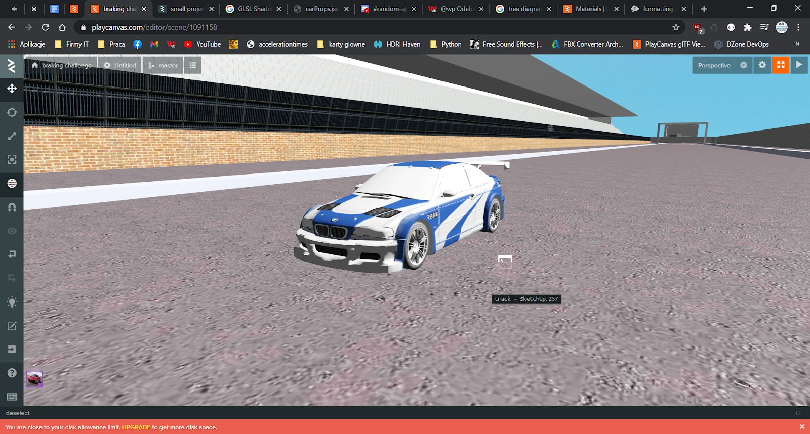{width="6.276097987751531in"
height="3.36740813648294in"}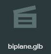{width="1.1050929571303587in"
height="1.1572200349956256in"}

2.3 model

> Modele 3D i animacje są tworzone poza PlayCanvas, eksportowane np. z
> Blendera,

Wings3D, Maya lub 3DS Max i importowane do PlayCanvas.

Zaleca się korzystać z formatu fbx dla uzyskania najlepszych wyników i
tak model zostanie przekonwertowany na glb (tzn fbx pozostanie jako
źródłowy format, ale zostanie stworzony glb jako docelowy format i co za
tym idzie będą dwa formaty fbx i glb danego modelu).

Więcej o modelach [[Models \| Learn
PlayCanvas]{.underline}](https://developer.playcanvas.com/en/user-manual/assets/models/)

2.4 animacja

Zasób animacja jest używany, aby odtwarzać pojedynczą animację na modelu
3D. Formaty pełnych scen zawierają animacje, np. jest to gltf, dae, fbx.

Więcej o animacji [[Animation \| Learn
PlayCanvas]{.underline}](https://developer.playcanvas.com/en/user-manual/assets/animation/)

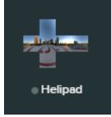{width="1.428280839895013in"
height="1.5012587489063867in"}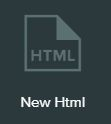{width="1.1572200349956256in"
height="1.2927504374453194in"}

2.5 tekstura sześcienna (cubemap)

> Tekstura sześcienna to specjalny typ tekstury składający się z 6
> zasobów tekstur.

Stosowana jest jako skybox lub mapa środowiska. Więcej o cubemap
[[Cubemaps \| Learn
PlayCanvas]{.underline}](https://developer.playcanvas.com/en/user-manual/assets/cubemaps/)

2.6 HTML

Zasób HTML zawiera kod HTML.

Aby wczytać HTML musisz napisać taki kawałek kodu js:

Teraz opiszę szybko działanie kodu.

Tworzy element div dynamicznie, później dodaje klasę o nazwie container.
Następnie podczepia tego diva do \<body\> i ustawia zawartość twojego
htmla jako element potomny dla div'a container.

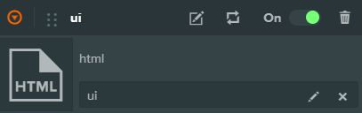{width="4.243143044619423in"
height="1.3344520997375329in"}

To jest jeden ze sposobów.

Oczywiście musisz jeszcze w tym przypadku dodać atrybut z nazwą **html**
(jeżeli w kodzie nazwałeś jako this.html, o atrybutach później), napisać
kod html, przeciągnąć plik html w edytorze do miejsca gdzie można
podczepiać czy to encje czy to różne zasoby, w tym przypadku jest to ui
pod komponentem script (tak jak widać to na poniższym rysunku), w ui
jest właśnie atrybut typu zasób o nazwie html (natomiast plik HTML
nazywa sie ui.html), dopiero wtedy masz zawartość HTML na swojej
stronie.

Więcej o HTML

[[HTML \| Learn
PlayCanvas]{.underline}](https://developer.playcanvas.com/en/user-manual/assets/html/)

2.7 audio

Zasób audio to plik dźwiękowy.

[[Audio \| Learn
PlayCanvas]{.underline}](https://developer.playcanvas.com/en/user-manual/assets/audio/)

2.8 CSS

Zasób CSS zawiera kod CSS.

Styl CSS podczepia się do strony podobnie jak w przypadku zasobu HTML,
czyli dodajesz atrybut o nazwie css, tworzysz kod CSS, przeciągasz plik
css w edytorze do miejsca gdzie można podczepiać czy to encje czy to
różne zasoby, czyli np. ui pod komponentem script, w ui jest właśnie
atrybut typu zasób o nazwie css, dopiero wtedy masz zawartość CSS na
swojej stronie, a więc zastosowany wygląd.

Kod do podczepiania CSSa jest trochę inny niż było to przy zasobie HTML.
Tym razem pokażę trochę inny sposób:

> // create element

Więc tak pobierany jest zasób CSS z rejestru zasobów, tworzony element i
wczytywany

zasób.

2.9 shader

Zasób shader zawiera kod GLSL, możesz też przesłać pliki z rozszerzeniem
.vert, .frag lub .glsl

Dwie pierwsze linijki dotyczą szukania w rejestrze zasobów shadera
wierzchołków i

fragmentów.

Dalej zdefiniowany jest shader z atrybutami: pozycja i uv. Do
właściwości vshader i fshader doczepiana jest zawartość zasobu shader,
najpierw shadera wierzchołków, później

fragmentów. Jako przedostatni krok tworzony jest shader i materiał.
Wreszcie ustawiany jest shader na materiał.

2.10 font

Zasób fontu zawiera obrazek z wszystkimi znakami fontu, Używa się go do
wyświetlenia

tekstu.

Więcej o font tutaj [[Fonts \| Learn
PlayCanvas]{.underline}](https://developer.playcanvas.com/en/user-manual/assets/fonts/)

2.11 duszek (sprite)

Sprite to grafika 2D, ze względu na to że książka dotyczy tworzenia gry
w 3D, temat 2D

zostaje pominięty

Więcej o sprite [[Sprite \| Learn
PlayCanvas]{.underline}](https://developer.playcanvas.com/en/user-manual/assets/sprites/)

2.12 prefab (w pc pod nazwą template)

Prefabrykat, czyli zasób zawierający część encji, pozwalający na
tworzenie wielu instancji,

dlatego przydatny jest przy konstruowaniu obiektów wyglądających tak
samo np. 1000 drzew jednego typu, 10 takich samych przycisków itd. W
PlayCanvas nie ma jeszcze wariantów prefabów, czyli np. jest bazowy
prefab samochód, a np. chcę mieć różne samochody mające te same cechy,
ale inne wartości, np. prędkość maksymalna lub przyspieszenie.

Więcej o prefabach [[Template \| Learn
PlayCanvas]{.underline}](https://developer.playcanvas.com/en/user-manual/assets/templates/)

Pominąłem temat zasobu Wasm. Myślę, że w miarę ok omówiłem możliwe
zasoby w

PlayCanvas.

Przejdę do części edytor.

> 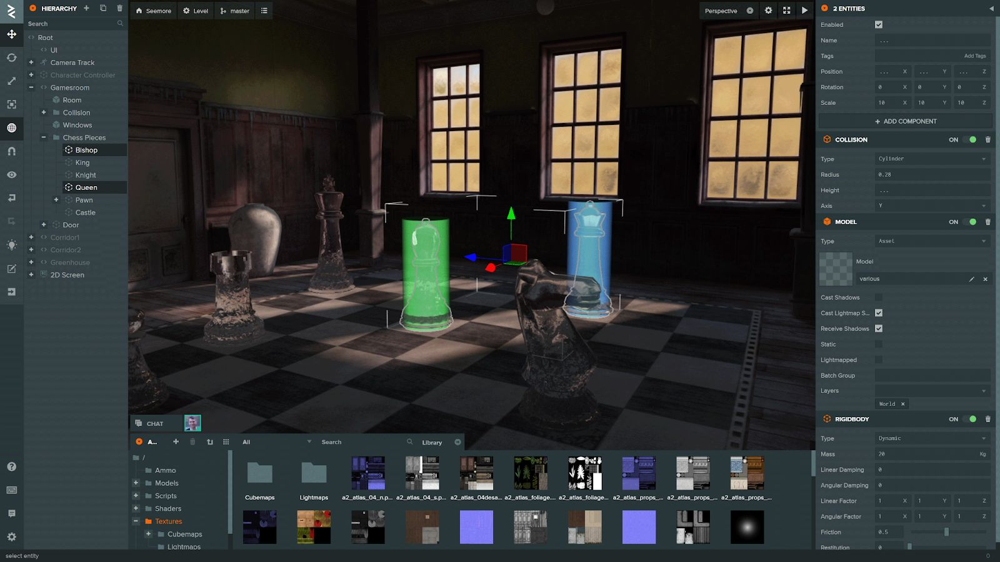{width="6.276097987751531in"
> height="3.5342147856517934in"}Część II - edytor
>
> Rozdział 3
>
> 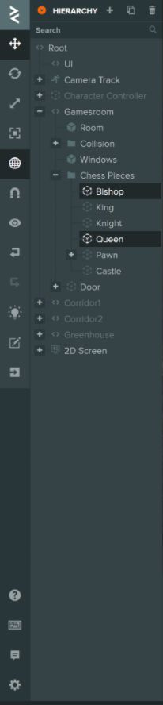{width="2.1476345144356954in"
> height="6.161418416447944in"}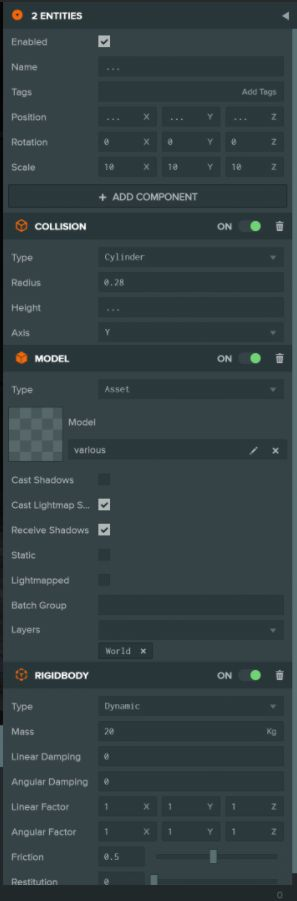{width="3.096347331583552in"
> height="6.359501312335958in"}UI
>
> 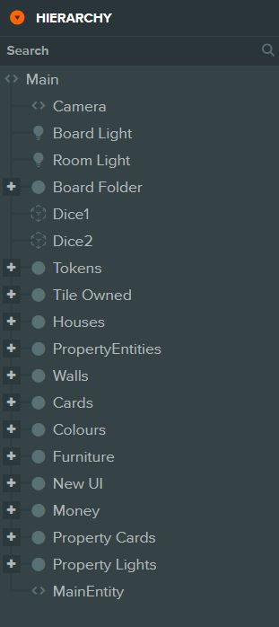{width="3.242303149606299in"
> height="7.2769378827646545in"}3.1 Panel hierarchia

{width="6.276099081364829in"
height="3.5342147856517934in"}

> Panel hierarchii zawiera graf sceny, widok drzewa. Graf ten składa się
> z korzenia,

domyślnie nazywa się on Root, w tym przypadku na rysunku nazywa się
**Main**, może też nazywać się Game.

Main w tym przypadku jest rodzicem takich encji jak:

Camera, Board i Room Light, Board Folder, Dice1, Dice2, Tokens, Tile
Owned, Houses, PropertyEntities, Walls, Cards, Colours, Furniture, New
UI, Money, Property Cards, Property Lights i MainEntity.

Jest to fragment gry planszowej Monopoly.

Dodatkowo te encje są rodzicami (wskazuje na to znaczek plusa) innych
encji itd.

Jak widzisz ta struktura jest bardzo złożona, dlatego tak ważne jest
grupowanie obiektów, np. jak to zostało przedstawione na rysunku.
Grupowanie obiektów to jedna z dobrych praktyk. Hierarchiczna struktura
pozwala na dobrą organizację elementów gry.

Jako mała dygresja: dlatego popatrz jak to jest realizowane na innych
przykładach gier stworzonych w PlayCanvas, przejdź do strony PlayCanvas
(musisz być zalogowany, zarejestrowany aby widzieć zawartość EXPLORE,
gdy już się zalogujesz przejdź do explore, zobaczysz tam różne projekty,
kliknij na **Project** przy danym projekcie.

Ja wybrałem SWOOP, jest to gra typu endless runner.

, przejdzie to do dalej overview projektu

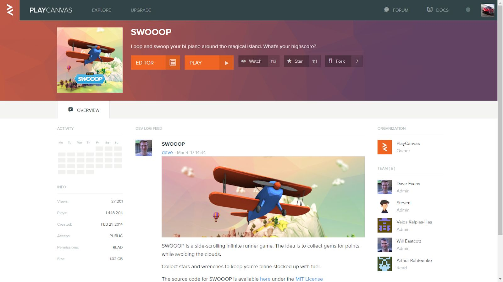{width="6.276099081364829in"
height="3.5342147856517934in"}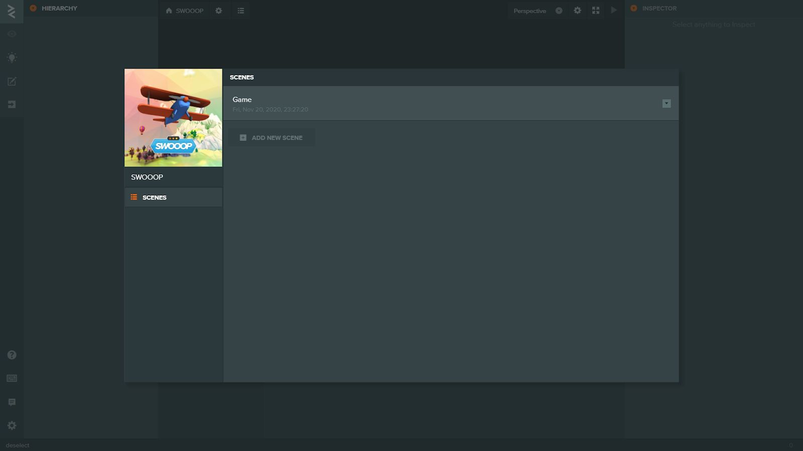{width="6.276099081364829in"
height="3.5342147856517934in"}

kliknij **EDITOR**,

kliknij na scenę w tym przypadku Game i już możesz zobaczyć hierarchię.

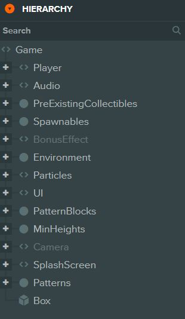{width="3.2318777340332456in"
height="5.5671708223972in"}

Pokażę jeszcze parę innych hierarchii np. hierarchię ze Space Buggy

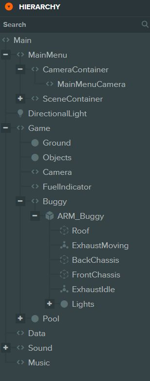{width="3.211026902887139in"
height="8.131821959755031in"}

Ciężko jest uchwycić na obrazku całą, rozwiniętą hierarchię.

Pokażę jeszcze jedną hierarchię z gry **Accelerally** i na tym zakończę
o hierarchiach.

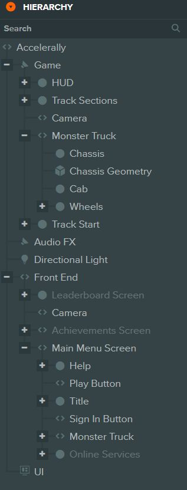{width="3.304855643044619in"
height="8.663518153980752in"}

Niektóre projekty mają zablokowaną opcję **Project** (np. TANX), można
tylko nacisnąć PLAY aby zagrać w grę , rysunek poniżej.

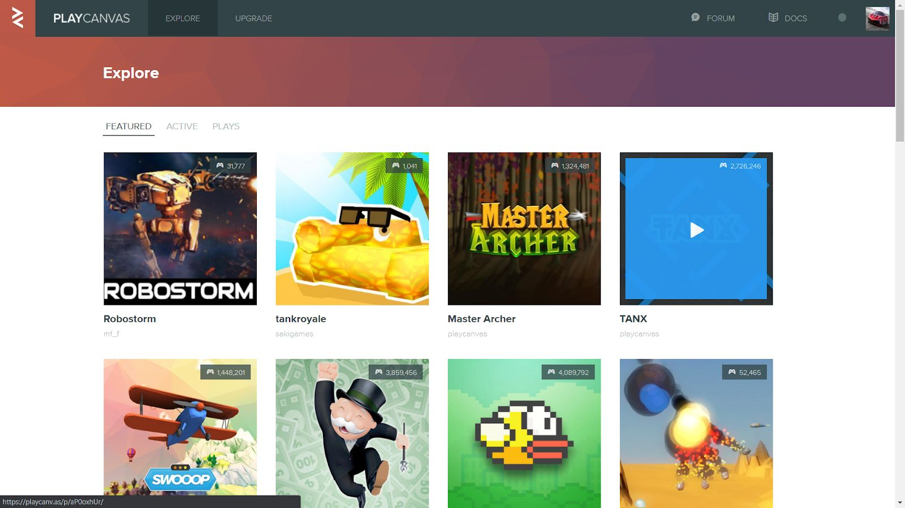{width="6.276099081364829in"
height="3.5342147856517934in"}

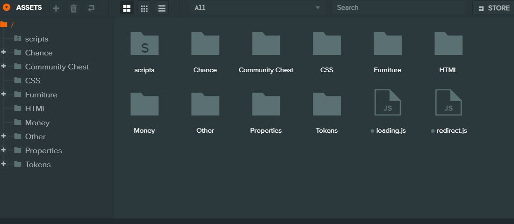{width="6.276099081364829in"
height="2.752308617672791in"}

3.2 Panel Zasoby

> Zasoby jest najlepiej organizować w folderach, np. skrypty w
> **scripts**, materiały w

**materials**, modele w **models**, tekstury w **textures** itp.

Po lewej na rysunku widzisz strukturę folderów: **/** to korzeń (root) w
nim znajdują się foldery w tym przypadku: scripts, Chance, Community
Chest, CSS, Furniture, HTML, Money, Other, Properties, Tokens, podobnie
tak jak to masz zorganizowane w systemie plików na systemie operacyjnym.

Po prawej widać foldery i pliki, foldery wyżej wymienione, 2 pliki:
loading.js i redirect.js Tutaj możesz przesłać swoje zasoby poprzez
upload, możesz przefiltrować kategoriami (tu gdzie jest All), wyszukać
dany zasób (Search), dodać nowy zasób lub usunąć istniejący, możesz też
wejść na PlayCanvas Store.

3.3 Panel inspektor

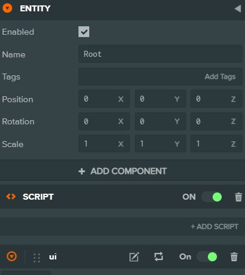{width="4.26399387576553in"
height="4.7956900699912515in"}

Tutaj możesz włączyć / wyłączyć encję (Enabled), nazwać encję (Name)

dodać tagi (Tags), ustawić transformację: pozycję (position), orientację
(rotation) i rozmiar (scale).

Co ważne wszystkie te własności są w przestrzeni **lokalnej**, modelu
(local space, model space).

Orientację ustawia się przy pomocy tak zwanych kątów Eulera. Możesz też
dodać komponenty (+ add component).

W tym przypadku dodanym komponentem jest komponent script w nim znajduje
się kod ui.js.

Encja może mieć wiele doczepionych skryptów js, np. UIHandler, Main,
Money, Dice, Movement, Cards, PropertyLight, assets,

jak to zostało pokazane na rysunku.

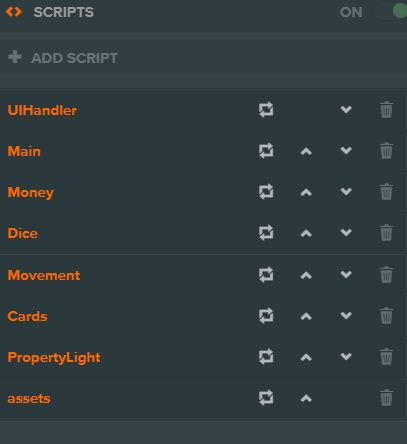{width="4.243143044619423in"
height="4.6288834208223975in"}

To tyle na temat inspektora, zostało jeszcze do mówienia menu i toolbar.

Przejdę do menu.

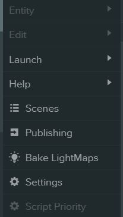{width="2.158059930008749in"
height="3.8052755905511813in"}

3.4 Panel Menu

Menu można pokazać klikając na przycisk z ikoną PlayCanvas.

Menu zawiera listę wszystkich poleceń, które możesz wykonać na scenie.

Tutaj można zrobić następujące rzeczy, dodać encję, edytować, uruchomić
grę, dostać się do pomocy, wyświetlić listę dostępnych scen, opublikować
grę, wypalić mapę świateł, otworzyć ustawienia, ustawić priorytet
wykonywania skryptów.

Ogólnie jest to skrót jeżeli nie możesz znaleźć przycisku lub nie
pamiętasz skrótu klawiszowego.

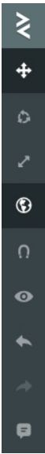{width="0.5942475940507437in"
height="5.921634951881015in"}

3.5 Panel Toolbar

Panel toolbar, pasek narzędzi zawiera najczęstsze polecenia dostępne w
wygodny sposób.

Najbardziej przydatny jest przycisk uruchom (skrót ctrl+enter), który
włącza grę w nowej karcie, wczytywana jest scena na której się
znajdujesz i po załadowaniu możesz testować, grać.

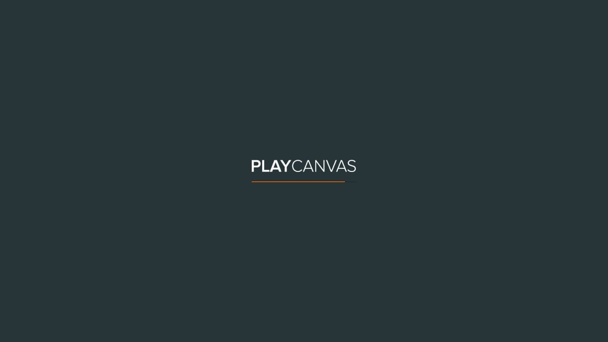{width="6.276099081364829in"
height="3.5342147856517934in"}

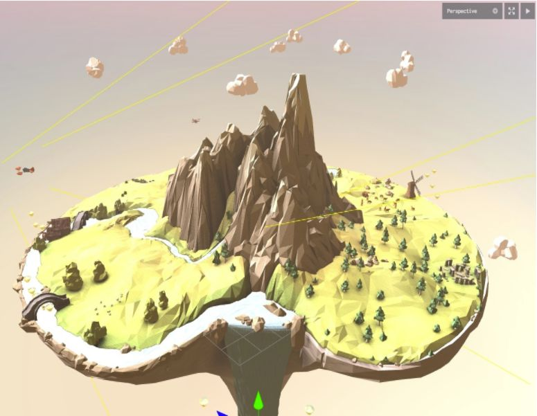{width="6.276097987751531in"
height="4.868667979002625in"}3.6 Viewport

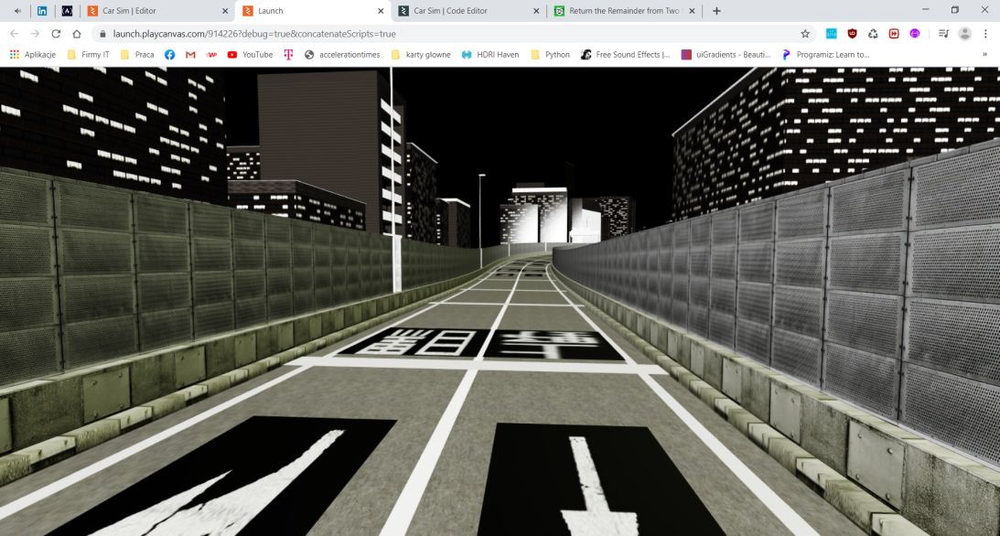{width="6.276097987751531in"
height="3.36740813648294in"}

Viewport pokazuje scenę aktualnie wyświetlaną. Możesz poruszać się po
scenie z klawiszami WASD i strzałkami góra, dół, lewo, prawo. Trzymając
shift przyspieszasz prędkość kamery, możesz w ten sposób przeglądać
scenę szybciej, jeżeli np. przestrzeń jest duża, np. tu.

Jest to model miasta, mod do gry Assetto Corsa, tutaj bardzo przydatny
jest sposób szybkiego przeglądania sceny.

Wracając do viewportu możesz ustawić kamerę na perspektywę lub
ortograficzną, w

przypadku orto są to widoki lewo, prawo, góra, dół, przód, tył (left,
right, top, bottom, front, back). Jeszcze możesz zmienić na widok z
innej kamery, np. kamery śledzącej (jeżeli taką ustawiłeś w hierarchii).
Na tym przykładzie dodatkowe kamery to SplashCamera i Camera. Na
marginesie kamery to po prostu macierze.

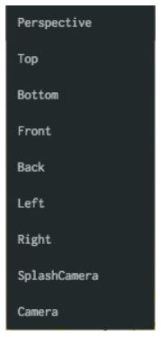{width="1.8661482939632545in"
height="3.304855643044619in"}

Teraz przejdę do omówienia części dotyczącej silnika.

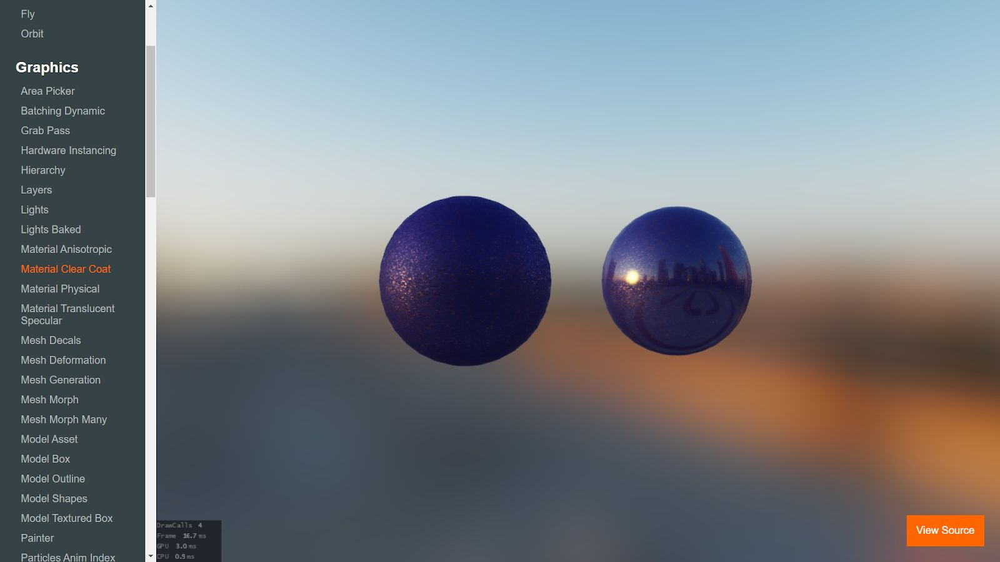{width="6.276097987751531in"
height="3.5342147856517934in"}Część III - silnik

> Rozdział 4
>
> 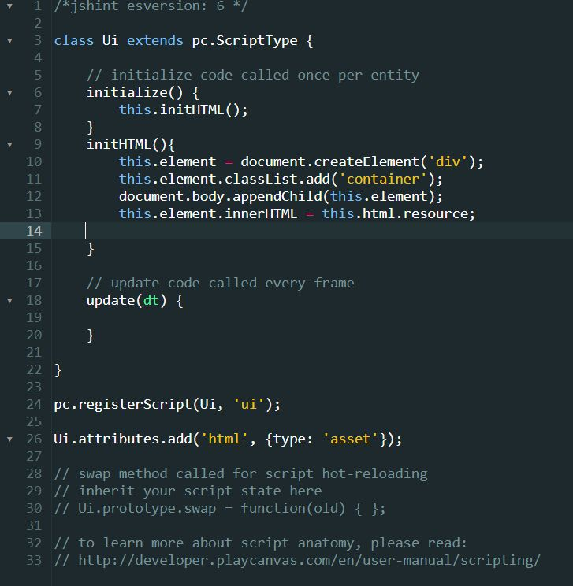{width="6.276097987751531in"
> height="6.422053805774278in"}skrypty
>
> 3.1 inicjalizacja i aktualizowanie
>
> **initialize()**
>
> Metoda initialize odnosi się do inicjalizacji, która wykonywana jest
> tylko raz dla encji do której został dodany skrypt po załadowaniu się
> aplikacji. Korzystasz z tej metody, gdy chcesz zdefiniować zmienne i
> stałe dotyczące konkretnej instancji skryptu, czyli np.
> **this**.speed, gdzie **this** odnosi się do skryptu, nie do window, a
> speed to nazwa zmiennej dostępna w initialize i update, w ten sposób
> możesz przekazać zmienną **this**.speed z initialize do update.
>
> **update(dt)**
>
> Aktualizacja może być realizowana poprzez zastosowanie animacji
> czasowej
>
> (time-based) lub klatkowej (frame-based). Jeżeli nie korzystasz z dt,
> czyli różnicy czasu (delta time) stosujesz animację klatkową. Skutkiem
> jest brak płynności w animacji. Natomiast gdy dorzucisz **dt**
> otrzymujesz wtedy płynną animację na podstawie czasu, a nie klatek na
> sekundę (fps). Dlatego najczęściej mnoży się parametr przez dt, np.
>
> **this**.speed \* dt.
>
> 3.2 atrybuty aka attributes.add()
>
> Dzięki atrybutom otrzymujesz możliwość szybszych iteracji, tzn jesteś
> w stanie eksperymentować z parametrami, tworząc i testować grę
> szybciej, np jeżeli jesteś designerem, a nie programistą, możesz
> dostosowywać parametry bezpośrednio z poziomu edytora zamiast w
> kodzie. Koncepcja podobna do Unity.
>
> Nawet nie potrzebujesz korzystać z dat.GUI.
>
> Nie ma sensu stosować atrybutów jeżeli pracujesz engine-only, dlatego
> że nie masz wtedy dostępu do edytora.
>
> Dostępne atrybuty: ● encji
>
> ● zasobu ● koloru ● krzywej
>
> ● wyliczenia ● JSON

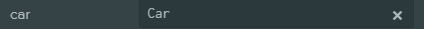{width="4.42037510936133in"
height="0.3023359580052493in"}

> **encji**

Jednym ze sposobów nawet lepszym niż korzystanie z find (find ogólnie
jest wolną operacją, może dlatego że korzysta z rekurencyjnego
wyszukiwania w głąb, DFS) jest odwoływanie się do encji poza skryptem za
pomocą atrybutu encji. Podajesz nazwę atrybutu encji, jej typ.

Na poniższym przykładzie odwołuję się do car, po to aby w ui mieć
informację na temat prędkości samochodu. Załóżmy, że encja car posiada
skrypt CarController, wtedy mogę się dostać do CarController przy pomocy
tego atrybutu encji car.

> Ui.attributes.add('car', {type: \'entity\'});

A tutaj można zauważyć efekt dodania powyższej linii i sparsowania kodu
(musisz nacisnąć

jeszcze Parse).

Zauważ, że car i Car różnią się między sobą tym że pierwsze dotyczy
nazwy **atrybutu** encji,

a drugie nazwy encji w hierarchii, więc zachowaj czujność!

Albo jak chcesz znajdź inny sposób, np. nazwij obydwa inaczej, to już
zostawiam Tobie jako, może nie wyzwanie, ale mikrozadanie.

Można też skorzystać z innego sposobu i nic nie przyczepiać, sposobem
tym są zdarzenia o

których później. **zasobu**

Atrybut zasobu pozwala na odwołanie się do zasobu znajdującego się w
projekcie, Można podać tylko typ jako zasób, czyli type: \'asset\' lub
ograniczyć tylko do wybranego typu zasobu: tekstura, model, materiał
itd.

Celem takiego zabiegu jest minimalizacja ewentualnej pomyłki, jeśli nie
możesz podczepić zasobu każdego typu, tylko wybranego, jesteś w stanie
upewnić się, że możesz przeciągnąć do slotu np. tylko tekstury, a nie
model czy materiał, aby to zrobić musisz dodać jeszcze właściwość
assetType i typ konkretnego zasobu:

**koloru**

Atrybut koloru pokazuje color pickera, Możesz jako typ podac 'rgb' lub
'rgba'.

> MyScript.attributes.add(\'color\', { type: \'rgba\' });

**krzywej**

Atrybut krzywej określa wartość, która zmienia się w czasie

> MyScript.attributes.add(\'wave\', { type: \'curve\' }); // one curve

**wyliczenia**

Dzięki atrybutowi wyliczenia możesz wybrać jedną wartość spośród kilku
opcji. Właściwość enum jest tablicą obiektów, czyli opcji.

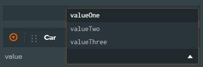{width="4.316120953630796in"
height="1.4387062554680665in"}W edytorze działa to jak dropdown, czy
HTML'owy \<select\>

**JSON**

Atrybut JSON jest nowym atrybutem, pozwala na zagnieżdżanie atrybutów,
czyli nadaje się do złożonych struktur związanych z grą, Przykład
poniżej dotyczy konfiguracji gry. Kluczowa jest tu właściwość schema,
która jest tablicą obiektów i zawiera definicje atrybutów, ale jest to
już dość specyficzny przypadek.

To są wszystkie możliwe atrybuty skryptu. Przejdę teraz do koncepcji
zdarzeń.

> 3.3 Komunikacja - zdarzenia

Komunikacja może występować jako przesyłanie parametrów od skryptu do
skryptu, czyli np. pomiędzy dwoma encjami lub dotyczyć aspektu
globalnego, tzn związanego ze zdarzeniami aplikacji.

Taki sposób posiada jedną zaletę, nie trzeba dzięki temu sprawdzać co
klatkę z instrukcjami warunkowymi if.

> zdarzenia skryptA-skryptB

Tak jak wspomniałem wcześniej zamiast korzystać z atrybutów encji i
przeciągać encję do slotu można to zrealizować przy pomocy zdarzeń
skryptowych. Jeśli chodzi o zdarzenia typu skryptA do skryptB, jest to
bezpośrednia metoda, a co za tym idzie szybsza niż w przypadku zdarzeń
aplikacji.

W zdarzeniach skryptowych stosuje się specjalne metody fire(), on() i
off().

fire() wyzwala zdarzenie, on() wykorzystywane jest w celu nasłuchiwania,
a off() wyłącza nasłuchiwanie.

W metodzie update() wywoływane jest zdarzenie z fire() i podawana jest
nazwa zdarzenia w tym przypadku 'move' z przekazywanymi od Player do
Display parametrami x, y.

> class Display extends pc.ScriptType{

Klasa Display otrzymuje parametry x i y, dokładniej chodzi o metodę
wywołania zwrotnego (callback) nazwaną tutaj onPlayerMove(). Jeżeli
gracz poruszy się, zostanie wyświetlona w konsoli wartość x i y,
console.log(x, y);

Aby dostać się do skryptu player, musisz odpowiednio odnieść się do
encji gracza (this.playerEntity), dostać się do komponentu script, aż w
końcu do skryptu player.

W on() przekazujesz nazwę zdarzenia 'move' z poprzedniej klasy (tzn
zależy co piszesz najpierw czy zaczynasz od części zawierającej fire()
czy on() ).

Wyłączasz 'move' z metodą off().

W taki oto sposób już wiesz jak działa komunikacja pomiędzy dwoma
skryptami, tutaj było to Display i Player.

> zdarzenia aplikacji

Aplikacja stanowi centralny magazyn w kontekście zdarzeń, nie musisz
odwoływać się do

encji.

Na tym przykładzie zauważ sposób pisania nazwy zdarzenia.

Widzisz, że nazwa zdarzenia składa się z player i move oddzielonym
dwukropkiem.

Więc taki sposób zapewnia na uniknięcie konfliktu nazw, np jeżeli masz
więcej 'move', to dobrym rozwiązaniem jest zastosowanie pewnej
przestrzeni nazw, czyli np. tak jak powyżej. fire() wyzwala zdarzenie
'player:move' z parametrami x i y.

> }

on() jest nasłuchiwaczem zdarzenia 'player:move', kluczowe jest tu
**this**.app.on() i

**this**.app.off(), dotyczą one zdarzeń aplikacji.

Wynik działania jest ten sam, zostanie wypisana w konsoli wartość x i y.

Z on() i off() mogłeś się już spotkać przy event-driven programming,
fire() jest specyficzną

metodą w PlayCanvas, a przynajmniej jej nazwa.

Przejdę teraz do grafiki, czyli mocnej strony tego silnika.

> Rozdział 5
>
> Grafika
>
> PlayCanvas ma zaawansowany silnik renderowania (rendering engine).
>
> Korzysta pod spodem z WebGL API do rysowania prymitywów (linii,
> punktów,
>
> krzywych itd.).
>
> W tym rozdziale przedstawię elementy grafiki takie jak: kamera,
> oświetlenie, renderowanie oparte na fizyce (szczególną uwagę poświęcę
> materiałom PBR), system cząsteczek i postprocessing.
>
> Nie skupiam uwagi na renderingu statycznej siatki i siatki typu
> skinned (static and skinned mesh rendering).
>
> 5.1 Kamera
>
> W WebGL nie ma czegoś takiego jak kamera, jest to po prostu macierz.
>
> Ale dzięki silnikowi gier, mamy dostęp do zaimplementowanej kamery.
>
> Kamera jest obiektem, który odpowiedzialny jest za wyświetlanie obrazu
> sceny na ekranie.
>
> Posiada różne właściwości: pole widzenia, płaszczyzny przycinania
> bliskiej i dalekiej (near, far clip) itd., ale jest to temat o
> CameraComponent, który znajduje się w dalszej części dotyczącej
> komponentów.
>
> W PlayCanvas są w 2 typy projekcji kamer: perspektywa i ortogonalna.
> Perspektywa polega na tym, że obiekty dalej położone są mniejsze, a
> bliżej położone większe, dlatego sprawia to wrażenie, że obraz jest w
> 3D.
>
> Perspektywę miałeś okazję widzieć, gdy pokazywałem mod z modelem
> miasta.
>
> 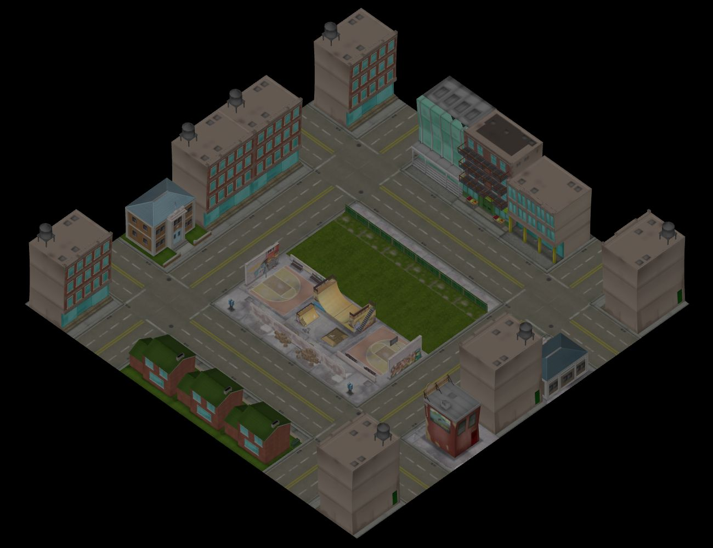{width="6.276097987751531in"
> height="4.826965223097113in"}Kamera ortogonalna dobrze sprawdza się w
> grach typu 2D lub 2.5D, zwane też pseudo3D (izometryczne) rysunek
> poniżej.

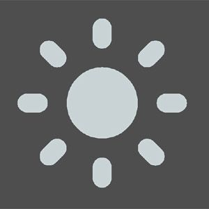{width="3.127623578302712in"
height="3.127623578302712in"}

> 5.2 Oświetlenie

Pod maską świateł kryją się shadery (programy cieniowania), czyli
symulacja oświetlenia

przebiega w taki sposób, że obliczany jest kolor każdego piksela na
podstawie

właściwości materiału powierzchni i źródeł światła. Innymi słowy na
podstawie przyjętego modelu cieniowania, który jest pewnym modelem
matematycznym. Oświetlenie może być dynamiczne lub ukryte w mapie
świateł.

Jeśli chodzi o światła to mamy do wyboru takie typy źródeł jak:
kierunkowe, punktowe i typu spot.

Kierunkowe są kojarzone z padaniem promieni słonecznych, czyli posiadają
tylko kierunek.

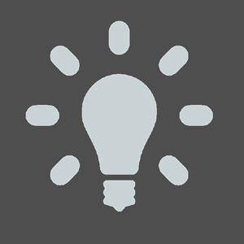{width="3.127623578302712in"
height="2.814861111111111in"}Punktowe emitują światło z jednego punktu
we wszystkie strony, czyli symulują żarówkę.

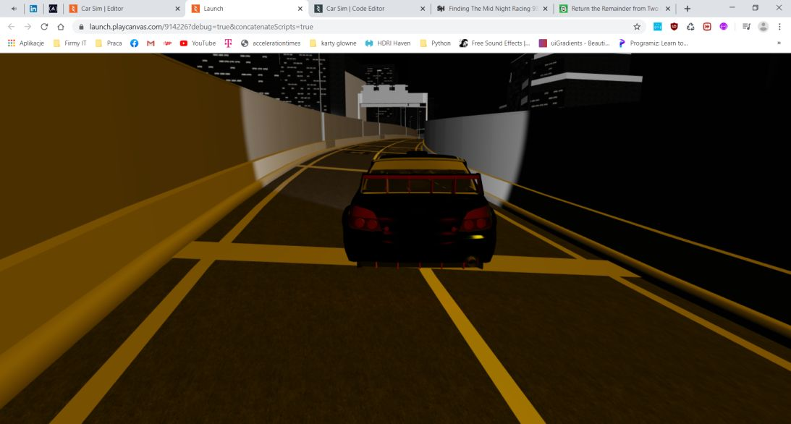{width="6.276097987751531in"
height="3.36740813648294in"}Spot, inaczej reflektorowe, emitują światło
w podobny sposób jak punktowe. Różnią się tym, że światło jest
ograniczone do kształtu stożka, dlatego dają taki efekt, więc przydają
się przy symulacji latarki lub reflektorów samochodu.

> 5.3 PBR

Tu poruszę bardziej zaawansowany temat dotyczący renderowania opartego
na fizyce

(physically based rendering), który jest bardzo popularny w grach.
Skupię się na

materiałach PBR, ponieważ ogólnie o PBR można napisać książkę, a nawet
jedna taka jest i to **bardzo** **dobra**, link do niej podaję tutaj

[[Physically Based Rendering: From Theory to
Implementation]{.underline}](http://www.pbr-book.org/)

Generalnie na PBR składa się: rozproszenie, odbicie, zachowanie energii,
metaliczność, Fresnel term i mikropowierzchnie.

Koncepcje te są pokazane poniżej.

> **rozproszenie** **(diffuse)**

Rozproszenie dotyczy sposobu interakcji pomiędzy symulowanym światłem i
materiałem. Jak sama nazwa wskazuje światło ulega rozproszeniu na
wszystkie strony.

> **odbicie** **(specular)**

Światło odbijane od powierzchni daje efekt blasku. **zachowanie**
**energii** **(energy** **conservation)**

Suma rozproszonego i odbitego światła nie może być większa niż wartość
całkowitego światła padającego na materiał. Oznacza to, że jeżeli
powierzchnia jest wysoce odblaskowa efektem będzie niskie rozproszenie
koloru.

> **metaliczność** **(metalness)**

Nadaje wygląd materiałowi jakby był wykonany z metalu. **Fresnel**

Efekt Fresnela, kąt pod którym patrzysz na powierzchnię ma wpływ na to w
jakim stopniu powierzchnia pokazuje refleksy.

> **mikropowierzchnie**

Mikropowierzchnie są związane z połyskliwością, działają na podobnej
zasadzie co mapy normalne ale na skali mikro, stąd mikropowierzchnie.
Definiują czy powierzchnia ma być szorstka czy gładka.

Powyższe koncepcje dotyczą ogólnie PBR. Teraz przedstawię jak to jest w
przypadku materiałów fizycznych.

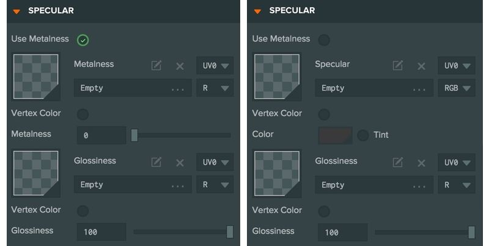{width="6.276099081364829in"
height="3.1693252405949255in"}

Więc tak w PlayCanvas możesz korzystać z 2 metod tzw. workflow:
Metalness i Specular.

Gdy zaznaczysz opcję Use Metalness, korzystasz... z Metalness, czyli
metaliczności.

W przeciwnym razie gdy odznaczysz tą opcję korzystasz wtedy ze Specular.

Obydwie metody dają te same rezultaty. Tak naprawdę jest to zależne od
twoich preferencji. Metalness powiązane jest z wartością od 0 do 1 (0 -
brak metaliczności, 1 - metal) lub mapą metalness, która zdecyduje jakie
obszary materiału mają być metaliczne.

Specular powiązane jest z wartością specular lub mapą specular, która
określa kolor i intensywność odbitego światła.

Jeśli chodzi o materiały PBR, podstawowym składnikiem jest kolor
rozproszenia inaczej

albedo. Jest to po prostu kolor materiału wyrażony wartością RGB (red,
green, blue). Można też skorzystać z mapy rozproszenia, aby np.
przypisać materiałowi teksturę zamiast koloru.

Załóżmy, że np. robisz grę podobną do Gran Turismo, inspirując się
licencjami chcesz mieć medale lub puchary w kolorze złota, srebra i
brązu.

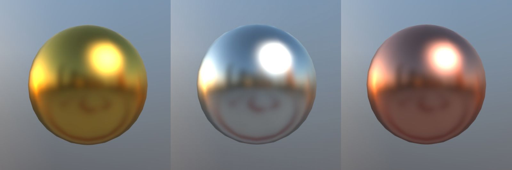{width="6.276099081364829in"
height="2.0850820209973753in"}

> Rozwiązaniem na to jest poszukanie wartości koloru w Internecie:
>
> Gold (1.000, 0.766, 0.336) or \[255, 195, 86\]
>
> Silver (0.972, 0.960, 0.915) or \[248, 245, 233\]
>
> Copper (0.955, 0.637, 0.538) or \[244, 162, 137\]

Jak widzisz na tabelce, pierwszy kolor to złoty, podana jest
znormalizowana wartość koloru

od 0 do 1 oraz od 0 do 255.

Drugi kolor to srebrny, a trzeci kolor to może nie brąz, ale dość
podobny. I tak oto masz puchary w tych kolorach.

Bylo o metalness i specular, ale nie było jeszcze o glossiness.

Parametr glossiness używany jest w metalness i specular, co może
zauważyłeś na rysunku

odnośnie workflow.

Glossiness określa jak gładka jest powierzchnia materiału, czyli stopień
połyskliwości, który mieści się w granicach 0-100. Możesz też skorzystać
z mapy glossiness.

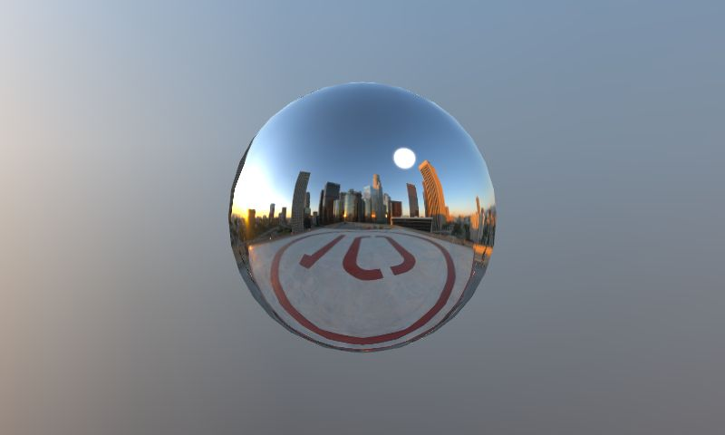{width="6.276099081364829in"
height="3.7635739282589675in"}

Na powyższym rysunku przypomina to trochę bombkę na choince, tak to
można sobie skojarzyć.

To tyle na temat terminów metalness, specular i glossiness.

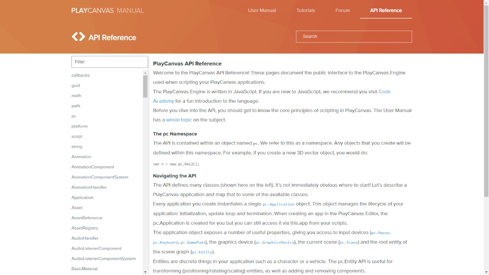{width="6.276097987751531in"
height="3.5342147856517934in"}

> Rozdział 6
>
> API omówienie

Poddane tutaj zostaną analizie takie klasy jak: Application, GraphNode,
Entity. Są jeszcze klasy dotyczące danego komponentu, nazwę to zbiorczo
**x**Component (np. AnimationComponent), gdzie **x** to jeden z podanych
komponentów:

Animation, Audio Listener, Button, Camera, Collision, Element, Layout
Child, Layout Group, Light, Model, Particle System, Rigid Body, Screen,
Script, Scrollbar, Scrollview, Sound, Sprite.

Są też systemy tych komponentów, czyli **x**ComponentSystem, gdzie **x**
to jeden z powyższych komponentów (np. AnimationComponentSystem).

Razem, taka struktura (Entity + Component + ComponentSystem) tworzy coś
co się nazywa ECS (Entity Component System). O komponentach i systemach
komponentów później.

I tak o to przejrzałem większość API PlayCanvas, reszta klas znajduje
się w Dodatku A, a najbardziej aktualną listę klas znajdziesz tutaj
[[PlayCanvas API
Reference]{.underline}](https://developer.playcanvas.com/en/api/) .

Przejdę teraz do klasy Application.

6.1 Application

Szczególną uwagę należy poświęcić podstawowemu obiektowi app typu
Application. Jest on bardzo specyficzny, ponieważ sam zawiera obiekty
typu:

AssetRegistry, Scene, Keyboard, Mouse, Touch, Gamepad. Jeszcze jedno,
**pc** to jest przestrzeń nazw (skrót od PlayCanvas).

> **pc.app**
>
> assets - rejestr zasobów (AssetRegistry) scene - scena (Scene)
>
> root - korzeń (Entity)
>
> graphicsDevice - urządzenie graficzne (GraphicsDevice)
>
> **input**:
>
> keyboard - klawiatura Keyboard mouse - mysz Mouse
>
> touch - urządzenie mobilne Touch gamepad Gamepad

Pozostałe obiekty, właściwości, metody dostępne tu [[Application \|
PlayCanvas API
Reference]{.underline}](https://developer.playcanvas.com/en/api/pc.Application.html)

6.2 GraphNode i Entity

**6.2.1** **GraphNode**

Dzięki klasie GraphNode można manipulować encjami: dodawać encje
potomne, pobierać / ustawiać orientację z kątami Eulera lub
kwaternionami, pobierać / ustawiać pozycję w przestrzeni świata lub
lokalnej, pobierać / ustawiać skalę tylko w przestrzeni lokalnej, ale
też umożliwić aby encja patrzyła w dany punkt (lookAt()). Jest jeszcze
parę innych metod nie omówionych w tej klasie.

**6.2.2** **Entity**

Klasa Entity rozszerza / dziedziczy po GraphNode, więc zawiera
odziedziczone metody takie jak:

addChild(), get/set\[Local\]Position/Rotation(), getLocalScale(),
lookAt(), get/set\[Local\]EulerAngles(), translate\[Local\](),
rotate\[Local\]().

> **addChild(node)**

Dodaje element potomny, na tym przykładzie jest to encja

Najpierw tworzony jest obiekt encji, a później dodawany ten element
potomny do elementu rodzica (**this**.entity)

Najczęstszy sposób by ustawić kamerę śledzącą, wtedy postać / pojazd to
element rodzic, a kamera jest elementem potomnym. Jest to też sposób
dynamicznego grupowania obiektów, np. encja nadrzędna miasto, encja
potomna budynek.

Pozycję, orientację i skalę można ustawić z trzema liczbami x, y, z lub
jednym wektorem Vec3

> **getEulerAngles()**

pobiera kąty Eulera w przestrzeni świata (world space)

Tak jak powyżej po to pobiera aby później obrócić encję wokół osi Y o
180 stopni **getLocalEulerAngles()**

pobiera kąty Eulera w przestrzeni lokalnej

> **this**.entity.setLocalEulerAngles(angles);

Pobiera aby później obrócić encję wokół **własnej** osi Y o 180 stopni
**getLocalPosition()**

pobiera lokalną pozycję

Pobiera aby później przesunąć encję o jedną jednostkę wzdłuż x.

**getLocalRotation()** pobiera lokalną orientację

> **const** rotation = **this**.entity.getLocalRotation();
>
> **getLocalScale()**

pobiera lokalną skalę

Pobiera aby później ustawić rozmiar x na 100 jednostek

> **getPosition()**

pobiera pozycję w przestrzeni świata

Pobiera aby później ustawić pozycję x na 10 jednostek

> **getRotation()**

pobiera orientację w przestrzeni świata

> **const** rotation = **this**.entity.getRotation();
>
> **lookAt(x,** **\[y\],** **\[z\],** **\[ux\],** **\[uy\],**
> **\[uz\])**

umożliwia aby encja patrzyła na inną encję, czyli w dany punkt

Można też ustawić aby encja patrzyła na punkt 0, 0, 0 **rotate(x,**
**\[y\],** **\[z\])**

Obraca encję w przestrzeni świata

> **rotateLocal(x,** **\[y\],** **\[z\])**

Obraca encję w przestrzeni lokalnej

> **setEulerAngles(x,** **\[y\],** **\[z\])**

ustawia kąty Eulera w przestrzeni świata (world space)

> **this**.entity.setEulerAngles(angles);
>
> **setLocalEulerAngles(x,** **\[y\],** **\[z\])**

ustawia kąty Eulera w przestrzeni lokalnej

> **setLocalPosition(x,** **\[y\],** **\[z\])**

ustawia lokalną pozycję

**setLocalRotation(x,** **\[y\],** **\[z\],** **\[w\])** ustawia lokalną
orientację

**setLocalScale(x,** **\[y\],** **\[z\])** ustawia lokalną skalę /
rozmiar

> **setPosition(x,** **\[y\],** **\[z\])**

ustawia pozycję w przestrzeni świata

> **setRotation(x,** **\[y\],** **\[z\],** **\[w\])**

ustawia orientację w kwaternionach w przestrzeni świata

> **translate(x,** **\[y\],** **\[z\])**

Przesuwa encję o x jednostek w przestrzeni świata

Tutaj przesuwa o 10 jednostek w przestrzeni świata

> **translateLocal(x,** **\[y\],** **\[z\])**

Przesuwa encję o x jednostek w przestrzeni lokalnej

Tutaj przesuwa o 10 jednostek w przestrzeni lokalnej

> Część IV - Encja
>
> \- obiekt gry

{width="4.26399387576553in"
height="4.7956900699912515in"}

> Rozdział 7
>
> Encja, Komponenty i Systemy
>
> **Encja**

Encja to obiekt gry (w silniku Unity nazywa się ona GameObject), który
jest kontenerem na

komponenty, dzięki niej można ustawić transformację obiektu (pozycja,
orientacja, rozmiar). Można też ukryć / pokazać obiekt (właściwość
Enabled). Najczęstszy przypadek to

ukrywanie jednego ekranu (screen) np. głównego menu, pokazanie innego
np. z opcjami lub ustawieniami gry. Nic nie stoi na przeszkodzie, aby
encja była pusta i nie zawierała żadnych komponentów, np. jeżeli chcesz
żeby to był punkt.

Załóźmy, że robisz konfigurator i chcesz mieć hotspoty. Dobrym sposobem
na to jest utworzenie **pustych** encji, które będą reprezentować punkt.

Albo inny przykład: chcesz mieć przejście kamery z punktu A do punktu B,
puste encje dobrze się sprawdzą.

Uwaga: jeżeli tworzysz nową encję, nazwiesz ją kamera, to nie jest to
kamera, ponieważ dołączenie do niej komponentu CameraComponent (czy to z
poziomu edytora na platformie, czy to engine-only) sprawi, że encja jest
dopiero wtedy kamerą.

No dobrze, ale co w przypadku jak encja zawiera więcej komponentów niż
jeden, czym wtedy jest? :)

Możesz jeszcze zastosować encję np. gdy chcesz mieć skrypt, ale nie w
Root. Przebiega to następująco: tworzysz nową encję, dodajesz do niej
komponent script i dorzucasz kod js, nazywasz tą encję adekwatnie do
nazwy kodu.

Poniższy rysunek może przekaże co mam na myśli.

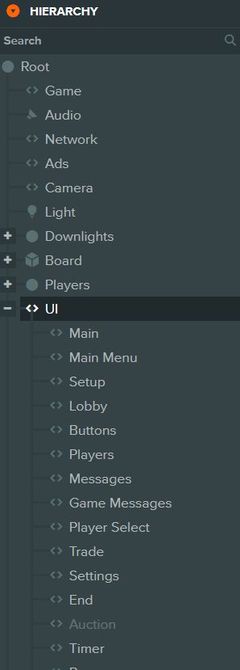{width="3.106771653543307in"
height="7.954588801399825in"}

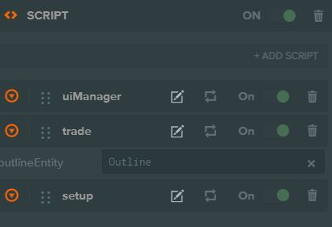{width="4.274419291338583in"
height="2.9295406824146983in"}

Znowu posługuję się przykładem z gry Monopoly. Więc tworzysz encję,
która nazywa się UI,

dodajesz do niej komponent script, dorzucasz kod np. uiManager.js,
trade.js, setup.js.

Na rysunku możesz zauważyć jeszcze, że podobnie postąpiono z elementami
potomnymi UI, czyli Main, Main Menu itd., co wskazuje na to ikonka
'znaczników' \<\>.

To jest jeden z takich trików, aby pozwolić na lepszą organizację w
hierarchii, przede wszystkim jest to bardziej zrozumiałe niż wpychanie
wszystkich skryptów do Root.

Podsumowując encja może zawierać komponenty lub nie, wtedy jest encją
pustą.

> **Komponenty**

Komponent nadaje encji pewne zachowanie, tak jak już mówiłem, żeby encja
była kamerą musi posiadać komponent kamery. Istnieją jeszcze inne
komponenty.

Ogólnie komponenty to pewien sposób projektowania oprogramowania.
Komponenty w tym przypadku są lepsze niż podejście klasowe, dlatego, że
z komponentami łatwiej jest zarządzać rzeczami w grze, ponieważ są
bardziej modularne i mniejsze niż klasy, to tak w skrócie.

Komponentów szczegółowo nie będę analizował. Poniżej znajduje się lista
18 komponentów. Komponenty (18):

> \- Animation
>
> \- Audio Listener - Button
>
> \- Camera - Collision

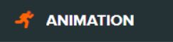{width="2.53337489063867in"
height="0.6255238407699037in"}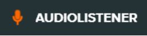{width="2.585501968503937in"
height="0.6359492563429572in"}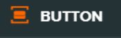{width="1.8348720472440945in"
height="0.5838221784776902in"}

> \- Element
>
> \- Layout Child - Layout Group - Light
>
> \- Model
>
> \- Particle System (system cząsteczek) - Rigid Body (bryła sztywna)
>
> \- Screen - Script
>
> \- Scrollbar
>
> \- Scrollview - Sound
>
> \- Sprite (duszek)
>
> **Animation**

Zacznę od komponentu animacji, określa które zasoby animacji są brane
pod uwagę.

> **Audio** **Listener**

Lokalizacja nasłuchiwacza audio podawana jest w tym komponencie. Dotyczy
ona

dźwięku pozycyjnego w 3D (positional audio). Przykład znajduje się tutaj
[[https://playcanvas.github.io/#sound/positional.html]{.underline}](https://playcanvas.github.io/#sound/positional.html)

> **Button**

Tworzy przycisk UI,

> **Camera**

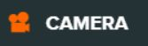{width="1.7410433070866143in"
height="0.5421216097987751in"}{width="2.0538057742782154in"
height="0.5421216097987751in"}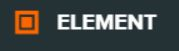{width="1.8661482939632545in"
height="0.5316951006124234in"}

Dodaje do encji kamerę, która wyświetla scenę z poziomu encji. Główne
właściwości

komponentu to typ projekcji: perspektywa czy ortogonalna, czyli
projection (perspective lub orthographic), pole widzenia (field of view)
w stopniach, płaszczyzny przycinania bliskiej i dalekiej (nearClip,
farClip), tzn na jaką odległość kamera widzi z bliska i daleka.
Pozostałe właściwości znajdziesz tutaj [[Camera \| Learn
PlayCanvas]{.underline}](https://developer.playcanvas.com/en/user-manual/packs/components/camera/)

> **Collision**

Komponent fizyczny Collision jest przydatny w wykrywaniu kolizji.
Dostępne typy kształtu kolizji (collision shape) to: box, sphere (kula),
capsule (kapsuła), mesh (siatka), compound (złożony z innych
podstawowych kształtów box, sphere itd.), cone (stożek), cylinder.
Jeżeli encja posiada tylko komponent collision jest wtedy tzw.
triggerem, który dobrze sprawdza się przy wykrywaniu kiedy otworzyć
drzwi w grze lub kiedy osiągnąłeś linię mety. Collision stosowany jest
najczęściej z rigidbody o którym później.

Jeszcze jedno odnośnie collision, ponieważ zdarzy się taka sytuacja, że
chcesz przesunąć kształt kolizji, ale problem w tym, że przesuwasz też
jednocześnie model 3D.

Trik polega na tym, żeby stworzyć encję rodzica (parent entity), wrzucić
tam komponent collision, a model dać jako encję potomną. W efekcie
możesz przesunąć kształt kolizji bez przesuwania modelu 3D.

> **Element**

Komponent Element jest elementem potomnym dla komponentu Screen.

Buduje się z nim interfejs użytkownika poprzez obrazki lub tekst,
dlatego można wybrać typ: Image lub Text.

> 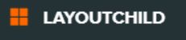{width="2.40826990376203in"
> height="0.5212696850393701in"}**Layout** **Child**

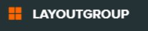{width="2.6272036307961506in"
height="0.5525470253718285in"}{width="1.4699825021872266in"
height="0.5525470253718285in"}{width="1.6784908136482939in"
height="0.5421205161854769in"}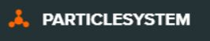{width="2.7731594488188978in"
height="0.5525470253718285in"}

Layout Child odnosi się do możliwości nadpisania parametrów Layout
Group.

> **Layout** **Group**

W Layout Group można ustawić orientację elementów UI na poziomą lub
pionową z

właściwością Orientation, która przyjmuje wartości Horizontal lub
Vertical.

Ważną właściwością jest Wrap, aktywując tą właściwość otrzymujesz
**siatkę** (grid), czyli elementy znajdujące się w wierszach i
kolumnach.

> **Light**

Jak już wiesz światło może posiadać typ: kierunkowy, punktowy lub
reflektorowy.

W PlayCanvas określa to właściwość Type z możliwymi opcjami:
Directional, Point lub Spot. Światłu możesz nadać kolor i intensywność,
z właściwościami Color i Intensity.

> **Model**

Model, z nim możesz wyświetlić prymitywy: box, capsule, cone. cylinder,
plane (płaszczyzna, nazywam to podłoga), sphere. Oprócz prymitywów
możesz też wyświetlić model 3D (w formacie .glb, .fbx itd.), aby to
zrobić musisz ustalić Type jako Asset. Komponent Model posiada
właściwość Model tam możesz znaleźć slot do którego możesz przeciągnąć
wybrany zasób z modelem 3D.

> **Particle** **System** **(system** **cząsteczek)**

Z tym komponentem ustawisz system cząsteczek, czy to deszcz czy śnieg.

> **Rigid** **Body** **(bryła** **sztywna)**

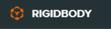{width="2.3457174103237097in"
height="0.6255238407699037in"}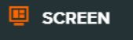{width="1.761894138232721in"
height="0.5316951006124234in"}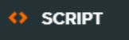{width="1.6889162292213473in"
height="0.5212696850393701in"}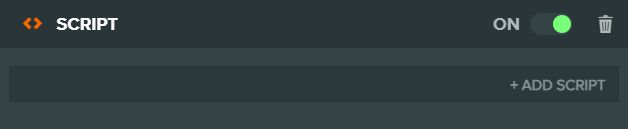{width="6.276099081364829in"
height="1.2927504374453194in"}

Kolejny komponent fizyczny to RigidBody, stosowany jest z komponentem
Collision.

RigidBody nadaje encji właściwości fizyczne takie jak: masa, tłumienie
liniowe i kątowe (linear, angular damping), tarcie (friction),
odbijalność (restitution).

Dodatkowo RigidBody posiada 3 typy: Static, Dynamic i Kinematic.

Na Kinematic nie oddziałują żadne siły, Static przydaje się dla podłoża,
trasy etc. Dynamic stosuje się w celach zapewnienia fizyki wraz z
siłami.

Mały tip: Nie zapomnij ustawić właściwości odbijalności na 0 przy typie
Static, jeżeli nie

chcesz aby obiekt się odbijał od podłoża.

> **Screen**

Screen to element rodzic dla komponentu Element. Definiuje obszar
wyświetlania elementów.

> **Script**

Komponent Script jest podstawowym komponentem najczęściej używanym. Za
pomocą

niego można doczepić skrypty w js (tzn nie bezpośrednio rysunek
poniżej).

Jako przykład możesz wyłączyć komponent Script, jeżeli doczepiłeś skrypt
z turn.js i nie chcesz żeby model się obracał.

Jako inny przykład możesz też włączyć ten komponent, aby uaktywnić
CarController.js, gdy chcesz aby samochód startował z linii startu
dopiero po odliczaniu 3,2,1. Sposobów innych pewnie znajdzie się więcej.

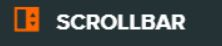{width="2.3144411636045494in"
height="0.47956911636045496in"}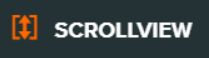{width="2.1789107611548557in"
height="0.604673009623797in"}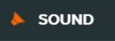{width="1.7306178915135608in"
height="0.6150995188101487in"}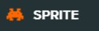{width="1.6889162292213473in"
height="0.5421205161854769in"}

> **Scrollbar**

Scrollbar dotyczy kontrolki przewijania dla poniższego komponentu
Scrollview. **Scrollview**

Scrollview określa obszar możliwy do przewijania. **Sound**

Komponent Sound kontroluje dźwięk, odtwarza zasoby audio. **Sprite**
**(duszek)**

Są dwa rodzaje wewnątrz tego komponentu: duszek prosty lub animowany.
Sprite wyświetla zasoby związane ze Sprite.

To są wszystkie możliwe komponenty w PlayCanvas. Nie omówiłem API tych

komponentów, więc resztę możesz znaleźć tutaj
[[https://developer.playcanvas.com/en/api/?filter=component]{.underline}](https://developer.playcanvas.com/en/api/?filter=component)

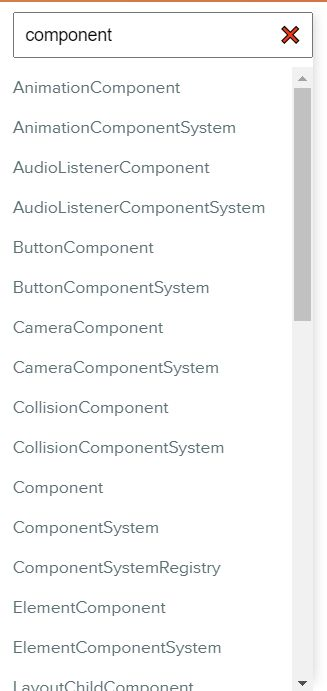{width="3.409109798775153in"
height="7.203959973753281in"}

Jeśli chodzi o to ComponentSystem, przegląd tego znajduje się poniżej,
czyli o Systemach.

> **Systemy**

Systemy, a dokładniej systemy komponentów inaczej menedźery, a w
PlayCanvas

**ComponentSystem**s odpowiedzialne są za zarządzanie komponentami. Jako
przykład podam

globalne ustawienie grawitacji wszystkim komponentom RigidBody, a
skorzystam w tym

przypadku z RigidBodyComponentSystem, ale dokładniej z gotowego obiektu
należącego do app.systems.

[**ComponentSystemRegistry**](https://developer.playcanvas.com/en/api/pc.ComponentSystemRegistry.html)
**systems**

The application\'s component system registry. The Application
constructor adds the following component systems to its component system
registry:

> ● animation
> [(AnimationComponentSystem](https://developer.playcanvas.com/en/api/pc.AnimationComponentSystem.html))
>
> ● audiolistener
> ([AudioListenerComponentSystem](https://developer.playcanvas.com/en/api/pc.AudioListenerComponentSystem.html))
> ● button
> [(ButtonComponentSystem)](https://developer.playcanvas.com/en/api/pc.ButtonComponentSystem.html)
>
> ● camera
> [(CameraComponentSystem](https://developer.playcanvas.com/en/api/pc.CameraComponentSystem.html))
> ● collision
> ([CollisionComponentSystem](https://developer.playcanvas.com/en/api/pc.CollisionComponentSystem.html))
> ● element
> ([ElementComponentSystem](https://developer.playcanvas.com/en/api/pc.ElementComponentSystem.html))
>
> ● layoutchild
> [(LayoutChildComponentSystem)](https://developer.playcanvas.com/en/api/pc.LayoutChildComponentSystem.html)
>
> ● layoutgroup
> [(LayoutGroupComponentSystem)](https://developer.playcanvas.com/en/api/pc.LayoutGroupComponentSystem.html)
> ● light
> [(LightComponentSystem)](https://developer.playcanvas.com/en/api/pc.LightComponentSystem.html)
>
> ● model
> [(ModelComponentSystem)](https://developer.playcanvas.com/en/api/pc.ModelComponentSystem.html)
>
> ● particlesystem
> ([ParticleSystemComponentSystem)](https://developer.playcanvas.com/en/api/pc.ParticleSystemComponentSystem.html)
> ● rigidbody
> ([RigidBodyComponentSystem)](https://developer.playcanvas.com/en/api/pc.RigidBodyComponentSystem.html)
>
> ● screen
> ([ScreenComponentSystem)](https://developer.playcanvas.com/en/api/pc.ScreenComponentSystem.html)
> ● script
> ([ScriptComponentSystem)](https://developer.playcanvas.com/en/api/pc.ScriptComponentSystem.html)
>
> ● scrollbar
> [(ScrollbarComponentSystem](https://developer.playcanvas.com/en/api/pc.ScrollbarComponentSystem.html))
>
> ● scrollview
> [(ScrollViewComponentSystem)](https://developer.playcanvas.com/en/api/pc.ScrollViewComponentSystem.html)
> ● sound
> [(SoundComponentSystem)](https://developer.playcanvas.com/en/api/pc.SoundComponentSystem.html)
>
> ● sprite
> ([SpriteComponentSystem)](https://developer.playcanvas.com/en/api/pc.SpriteComponentSystem.html)

Jak widzisz w systems są jeszcze inne systemy komponentów (np. animation
typu

AnimationComponentSystem). Daruję sobie omawianie ich, ponieważ
wszystkie działają na podobnej zasadzie, czyli dotyczą ustawień
globalnych.

Wracając do przykładu z rigidbody system, dostaję się do niego poprzez
app.systems, czyli mam app.systems.rigidbody. Następnie ustawiam
globalną grawitację (a w

zasadzie jej brak) z gravity.set(0,0,0), więc razem otrzymuję powyższą
linijkę kodu, chyba wiesz jak ją złożyć?

A i systems to rejestr systemów. Pozwolę sobie zakończyć ten rozdział i
przejść dalej do przykładów.

> Część V -przykłady
>
> Rozdział 8
>
> PlayCanvas -przykłady

Zostaną przeanalizowane dwa techniczne dema, After the Flood i Casino,
szczegółowo kodu nie będę omawiał, bo zajęłoby to z pewnością z kilkaset
a może i nawet kilka tysięcy stron, więc poddam analizie demo Casino pod
kątem hierarchii (i to bardzo szczegółowo, nie tak pobieżnie jak to było
w części o edytorze przy panelu hierarchia), organizacji zasobów,
szczególnie skryptów, ale też pod względem graficznym.

Natomiast ze względu na zbyt dużą złożoność dema After the Flood
ograniczę tylko do krótkiej analizy graficznej i skryptów.

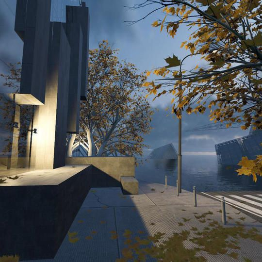{width="5.629723315835521in"
height="5.629723315835521in"}

> 8.1 After the Flood

**Krótka** **analiza** **grafiki** **i** **skryptów**

After the Flood to pokaz możliwości WebGL 2 ze współpracą teamu
PlayCanvas i Mozilla. Jak widzisz na rysunku tekstury 3D w postaci
proceduralnych chmur stworzone z szumem Worley-Perlin robią wrażenie.

Co zawiera jeszcze to demo? Zawiera proceduralną wodę, animowane liście
z systemem cząsteczek po stronie GPU, renderowanie HDR z antialiasingiem
wielopróbkowym (MSAA, multisampling antialiasing), sprzętowe PCF
dotyczące cieni, Alpha to coverage, wypalanie mapy świateł w czasie
rzeczywistym i odbicia lustrzane.

W przypadku tego projektu kod js nie znajduje się w folderze scripts.

Znalazłem takie pliki js:

alphaToCoverage.js, ambient.js, assignLight.js, assignLights.js,
changeCamera.js, cloth.js, controller.js, debugShaderExplosion.js,
demoSettings.js, dontDrawToDepth.js, finalScene.js, finalTempLamp.js,
findIdenticalShaders.js, fly-camera.js, foliage.js, fps.js,
hideDistance.js, instancingGroup.js, layerSetup.js, leavesParticle.js,
leavesShadows.js, less.min.js, loader.js, loading.js, loadShaders.js,
makeBrighter.js, mirror.js, namespace.js, noAlphaTest.js,
objExportLib.js, opacityFresnel.js, patchCubemap.js, patchFog.js,
placeLeaves.js, post2bloom.js, post2colorCorrection.js,
post2grabColor.js, postprocess.js, recordShaders.js,
reflectableWorld.js, refractiveMaterial.js, renderDebug.js,
replaceMipmappedTexture.js, setLayer.js, setNewLayers.js,
shaderBuild.js, shaderComplexity.js, shadowCasterControl.js,
singleMesh.js, sky.js, skyboxToggle.js, softParticle.js, specularAA.js,
subMirror.js, testExample.js, totalTime.js, tree.js, ui.js,
volumelight.js, water.js, wire.js, wireUpdate.js, xlimit.js, zprepass.js

Na poniższej liście opisuje krótko każdy plik js:

> 1\. alphaToCoverage - właściwość materiału
>
> 2\. ambient - muzyka ambient
>
> 3\. assignLight, assignLights - przypisanie świateł 4. changeCamera -
> zmień kamerę
>
> 5\. cloth - animacja tkaniny
>
> 6\. controller - kontroler postaci
>
> 7\. debugShaderExplosion - shader eksplozji w trybie debug 8.
> demoSettings - ustawienia technicznego dema
>
> 9\. dontDrawToDepth - nie zezwala na rysowanie do bufora głębi 10.
> finalScene - końcowa scena
>
> 11\. finalTempLamp - końcowa tymczasowa lampa
>
> 12\. findIdenticalShaders - znajduje identyczne shadery z
> wykorzystaniem odległości edycyjnej
>
> 13\. fly-camera - camera latająca 14. foliage - listowie (zbiór liści)
> 15. fps - klatki na sekundę
>
> 16\. hideDistance - ukrywa dystans
>
> 17\. instancingGroup - grupa instancji potrzebna przy batching 18.
> layerSetup - ustawienia warstwy
>
> 19\. leavesParticle - animowane liście z systemem cząsteczek po
> stronie GPU
>
> 20\. leavesShadows - cienie liści 21. loader - loader
>
> 22\. loading - ekran wczytywania (loading screen) 23. loadShaders -
> wczytywanie shaderów
>
> 24\. makeBrighter - rozjaśnia światła uliczne 25. mirror - odbicia
> lustrzane
>
> 26\. namespace - przestrzeń nazw, globalny obiekt atf (after the
> flood) 27. noAlphaTest - brak testu alfa
>
> 28\. objExportLib - biblioteka do eksportu modelu obj
>
> 29\. opacityFresnel - przezroczystość Fresnela (kod nieaktywny) 30.
> patchCubemap - patch tekstury sześciennej
>
> 31\. patchFog - patch mgły
>
> 32\. placeLeaves - umieszcza liście dynamicznie 33. post2bloom - efekt
> bloom
>
> 34\. post2colorCorrection - korekcja koloru 35. post2grabColor - grab
> color
>
> 36\. postprocess - postprocessing
>
> 37\. recordShaders - zapis cache shaderów 38. reflectableWorld - świat
> odblaskowy 39. refractiveMaterial - refrakcja materiału
>
> 40\. renderDebug - wyświetlanie w trybie debug
>
> 41\. replaceMipmappedTexture - zamienia mipmapowana teksturę 42.
> setLayer - ustawia warstwę
>
> 43\. setNewLayers - ustawia nowe warstwy 44. shaderBuild - buduje
> shader
>
> 45\. shaderComplexity - profile shadera (losowy, postaci, postaci
> wierzchołków, postaci pikseli, key, czas linkowania shadera)
>
> 46\. shadowCasterControl - kontrola cieni
>
> 47\. singleMesh - łączy siatki (combine mesh), batching 48. sky -
> proceduralne chmury
>
> 49\. skyboxToggle - przełączanie skybox'a
>
> 50\. softParticle - zmiękczanie systemu cząsteczek 51. specularAA -
> lustrzany antialiasing
>
> 52\. subMirror - ustawienie offsetu głębi lustra
>
> 53\. testExample - przykład testowy 54. totalTime - całkowity czas
>
> 55\. tree - instancja drzewa
>
> 56\. ui - interfejs użytkownika, tutaj dynamiczne przełączanie
> pomiędzy panelami menu, ustawienia, info itd.
>
> 57\. volumelight - światło przestrzenne 58. water - proceduralna woda
>
> 59\. wire - drut
>
> 60\. wireUpdate - aktualizacja związana z drutem 61. xlimit - limit
> pozycji x
>
> 62\. zprepass - dotyczy bufora głębi

Jak widzisz dużo się dzieje w tym demie, dlatego zrezygnowałem z analizy
kodu, opisałem tylko pliki js.

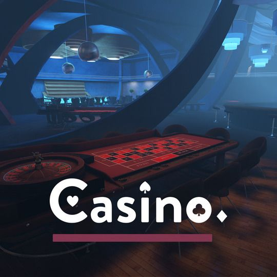{width="5.629723315835521in"
height="5.629723315835521in"}

> 8.2 Casino

Demo Casino powstało dzięki teamowi PlayCanvas. Jest mniejsze od After
the Flood pod

względem ilości kodu oraz plików js, więc przeanalizuję jego hierarchię,
wspierając się zrzutami ekranowymi. Będę musiał podzielić hierarchię na
kilka screenshotów. **Analiza** **hierarchii**

Zacznę od głównych encji, a później będę po kolei rozwijał hierarchię.

Jak się jednak okazuje struktura drzewa jest płaska, jedynie encja
cameraPath zawiera encje potomne.

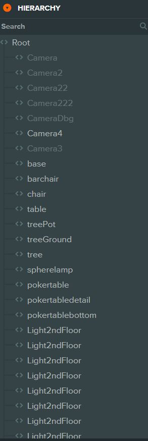{width="3.0546456692913386in"
height="9.111811023622048in"}

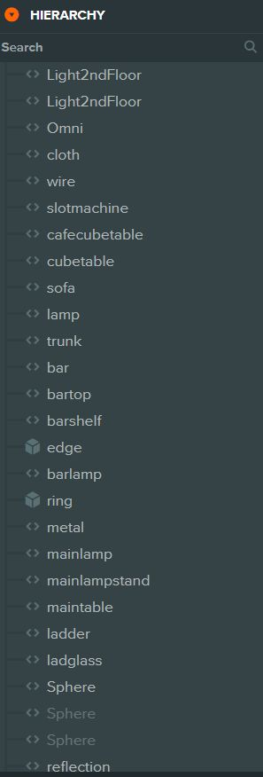{width="3.096347331583552in"
height="9.132661854768154in"}

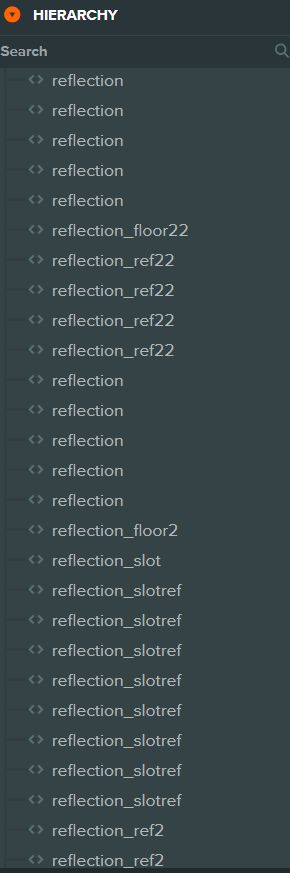{width="3.0233694225721783in"
height="9.101385608048993in"}

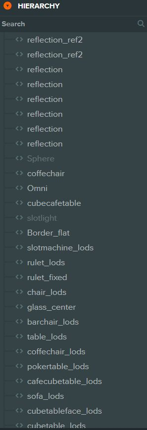{width="3.096347331583552in"
height="9.059683945756781in"}

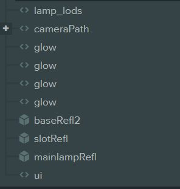{width="3.0859219160104985in"
height="3.2318777340332456in"}

Kamery oprócz Camera4 najprawdopodobniej nie są używane. Jest tu jednak
jedna wada, obiekty nie są pogrupowane.

Ogólnie możesz zauważyć tutaj takie encje jak: krzesło barowe, krzesło,
stół, drzewo, stół do pokera, światło na drugim piętrze, automat do
gier, sofa, bar, odbicia, odbicia automatu do gier, stół do ruletki,
poziom szczegółowości LOD (automatu do gier, stołu do ruletki, sofy,
stołu do pokera), interfejs użytkownika, efekt glow, ścieżka kamery i
inne. Głównych encji naliczyłem 117, jeszcze ścieżka kamery ma 12 encji
potomnych co daje w sumie 129 encji w projekcie, czy jest to dużo, mało
na pewno nie, dużo też nie. Na tym zakończę analizę hierarchii.

**Analiza** **zasobów**

Jeśli chodzi o zasoby w projekcie to nie ma ich dużo, więc analiza
pójdzie szybko i ograniczę tylko do krótkiego opisu i pokazania modeli
3D.

Folder główny zawiera foldery (scripts, json, materials, models,
textures) i pliki (!Cubemap, baseRefl2, ui.html, ui_css.css).

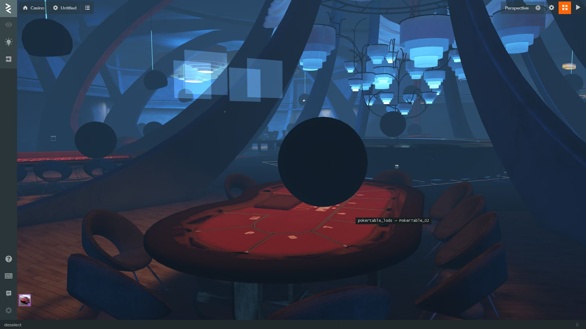{width="6.276099081364829in"
height="3.5342147856517934in"}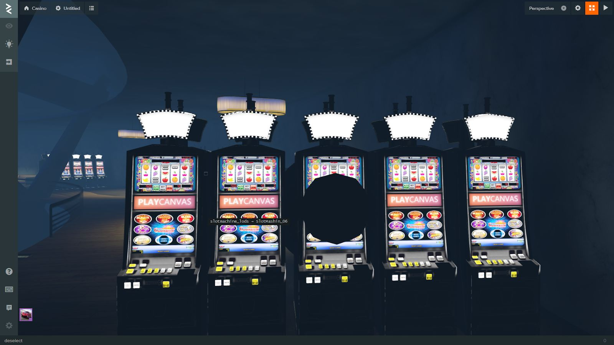{width="6.276099081364829in"
height="3.5342147856517934in"}

Można w projekcie znaleźć między innymi takie modele 3D jak: krzesło
barowe, krzesło, stół, drzewo, stół do pokera, automat do gier, sofa,
bar, półka barowa, stół do ruletki, stolik do kawy.

*stół* *do* *pokera* *i* *krzesła*

*automaty* *do* *gier*

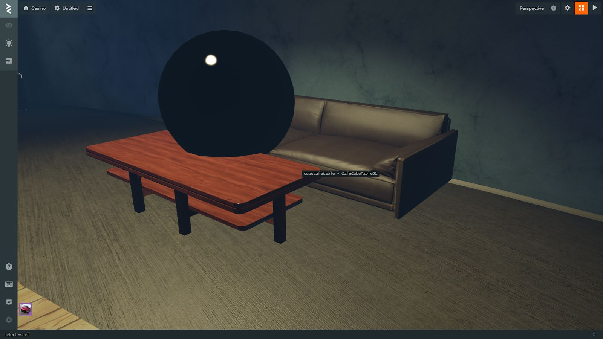{width="6.276099081364829in"
height="3.5342147856517934in"}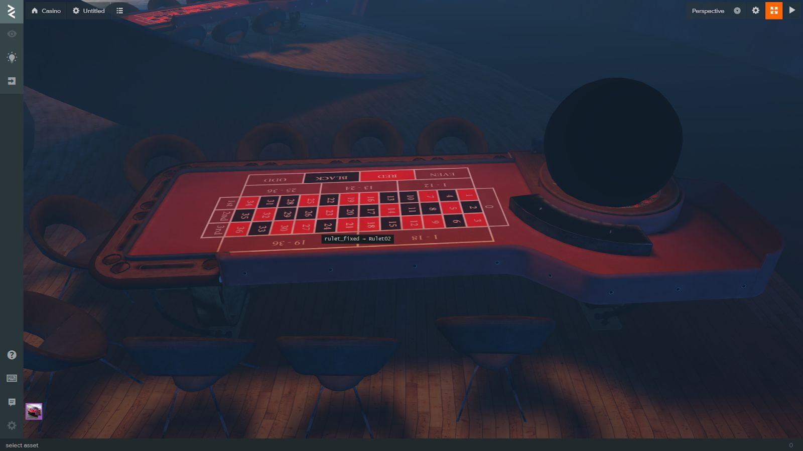{width="6.276099081364829in"
height="3.5342147856517934in"}

*stolik* *do* *kawy* *i* *sofa*

*stół* *do* *ruletki*

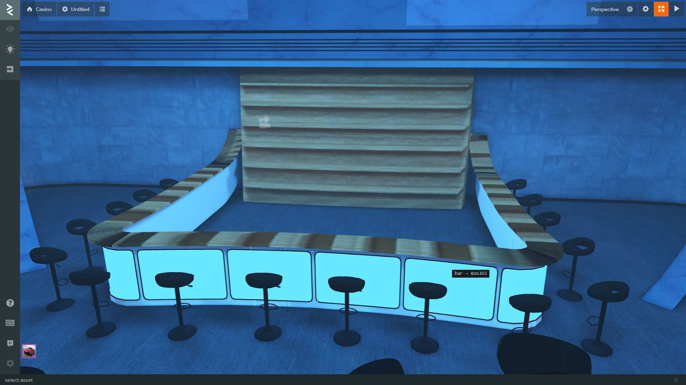{width="6.276099081364829in"
height="3.5342147856517934in"}

*bar* *i* *półka* *barowa*

**skrypty**

W projekcie możesz znaleźć następujące skrypty js: bakeLight.js - wypala
światła

> Cull.js - culling kamery distCull.js - culling odległości
>
> pickReflection.js - wybiera odbicie animCamera.js - animacja kamery
> loadingScreen.js - ekran wczytywania rotateReflection.js - obraca
> odbicie fixGloss.js - naprawia blask
>
> occludeWithLM.js - okluzja z lightmapą (LM - lightmap) lightProbe.js -
> próbka światła
>
> lod.js - poziom szczegółów (LOD) glow.js - efekt glow
>
> flyCamera2.js - kamera latająca reflectionProbe.js - próbka odbić
> overrideLM.js - nadpisuje lightmapę
>
> renderReflection.js - wyświetla odbicia fog.js - mgła przestrzenna
>
> tileOffsetWorkaround.js - rozwiązanie problemu z offsetem ui.js -
> interfejs użytkownika
>
> foliage.js - listowie dontLod.js - nie aktywuj LOD cullPrewarm.js -
> culling
>
> lightProbeAtEachNode.js - próbka światła przy każdym węźle
> optimize.js - optymalizacja
>
> bicubicLM.js - lightmapa dwusześcienna

**krótka** **analiza** **grafiki**

Demo prezentuje pokaz zastosowania materiałów PBR, o których było
wcześniej, mgły przestrzennej, reflection probe, light probe, generowane
przez silnik lightmapy, paraboloidalne odbicia w czasie rzeczywistym,
poziom szczegółowości modeli 3D LOD. W demie można przełączyć kamerę
pomiędzy kinematyczną, a latającą (można wtedy przeglądać całą scenę).

To było na tyle odnośnie grafiki.

**Na** **co** **zwrócić** **uwagę?**

Jeszcze jedna sprawa, na co możesz jeszcze zwrócić uwagę, możesz dodać
multiplayer / networking w swojej grze, AI np. z biblioteką Yuka [[Yuka
\| A JavaScript library
for]{.underline}](https://mugen87.github.io/yuka/) [[developing Game
AI]{.underline}](https://mugen87.github.io/yuka/), spróbować zintegrować
PlayCanvas z Tensorflow.js. Dorzucić Vue albo Reacta, skorzystać z PCUI,
libki komponentów UI od PlayCanvas
[[PCUI.]{.underline}](http://playcanvas.github.io/pcui/)

Możesz jeszcze zbudować z Apache Cordova, aby stworzyć grę mobilną,
która będzie aplikacją hybrydową, w ten sposób jesteś w stanie wrzucić
na Sklep Google (Google Play) lub Amazon App Store.

Doszedłeś do końca książki, dzięki za przeczytanie jej!

Życzę Ci powodzenia w PlayCanvas, mam nadzieję, że triki które tu
opisałem, a było ich parę przydadzą Ci się :)

Jeszcze raz zachęcam do zajrzenia do książki [[Physically Based
Rendering: From Theory to]{.underline}](http://www.pbr-book.org/)
[[Implementation]{.underline}](http://www.pbr-book.org/) , możesz też
sięgnąć po *Real-Time* *Rendering,* *Fourth* *Edition* *4th* *Edition* .

> Dodatek A
>
> API
>
> **pc** callbacks
>
> guid math path platform script string
>
> **Animation**
>
> Animation AnimationComponent AnimationComponentSystem AnimationHandler
>
> **Asset** Asset
>
> AssetReference AssetRegistry
>
> **Audio** AudioHandler
>
> AudioListenerComponent AudioListenerComponentSystem
>
> **Batch**
>
> Batch
>
> BatchGroup BatchManager
>
> **Component**
>
> Component
>
> ComponentSystem ComponentSystemRegistry
>
> **Element**
>
> ElementComponent
>
> ElementComponentSystem ElementDragHelper ElementInput
> ElementInputEvent ElementMouseEvent ElementTouchEvent
>
> **Layout** LayoutChildComponent LayoutChildComponentSystem
> LayoutGroupComponent LayoutGroupComponentSystem
>
> **Model**
>
> Model
>
> ModelComponent ModelComponentSystem ModelHandler
>
> **Morph** Morph
>
> MorphInstance MorphTarget
>
> **Script** ScriptAttributes
>
> ScriptComponent ScriptComponentSystem ScriptHandler ScriptRegistry
> ScriptType
>
> **Sound**
>
> Sound
>
> SoundComponent SoundComponentSystem SoundInstance SoundInstance3d
> SoundManager SoundSlot
>
> **Sprite** Sprite
>
> SpriteAnimationClip SpriteComponent SpriteComponentSystem
> SpriteHandler
>
> **Texture**
>
> Texture TextureAtlas TextureAtlasHandler TextureHandler
>
> **Touch**
>
> Touch TouchDevice TouchEvent
>
> **Vec**
>
> Vec2 Vec3 Vec4
>
> **Vertex**
>
> VertexBuffer VertexFormat VertexIterator
>
> **XR**
>
> XrHitTest XrHitTestSource XrInput XrInputSource XrManager
>
> ***pozostałe***
>
> Application
>
> BasicMaterial
>
> **bounding** BoundingBox
>
> BoundingSphere
>
> **button** ButtonComponent
>
> ButtonComponentSystem
>
> **camera** CameraComponent
>
> CameraComponentSystem
>
> **collision** CollisionComponent CollisionComponentSystem
>
> Color
>
> **contact** ContactPoint
>
> ContactResult
>
> **container** ContainerHandler
>
> ContainerResource
>
> Controller
>
> CubemapHandler
>
> **curve** Curve
>
> CurveSet
>
> Entity
>
> EventHandler
>
> **font** Font
>
> FontHandler
>
> ForwardRenderer Frustum GamePads GraphicsDevice GraphNode
>
> Http I18n
>
> IndexBuffer
>
> **keyboard**
>
> Keyboard KeyboardEvent
>
> **layer**
>
> Layer
>
> LayerComposition
>
> **light** LightComponent
>
> LightComponentSystem Lightmapper
>
> **Mat** Mat3
>
> Mat4
>
> **Material** Material
>
> MaterialHandler
>
> **Mesh** Mesh
>
> MeshInstance
>
> **Mouse** Mouse
>
> MouseEvent
>
> Node
>
> OrientedBox
>
> **particle** **system** ParticleSystemComponent
> ParticleSystemComponentSystem
>
> Picker
>
> **post** **effect** PostEffect
>
> PostEffectQueue
>
> Quat
>
> **ray** Ray
>
> RaycastResult
>
> RenderTarget
>
> **resource** ResourceHandler
>
> ResourceLoader
>
> **rigidbody** RigidBodyComponent RigidBodyComponentSystem
>
> **scene** Scene
>
> SceneHandler
>
> **scope** ScopeId
>
> ScopeSpace
>
> **screen** ScreenComponent
>
> ScreenComponentSystem
>
> **scrollbar** ScrollbarComponent
>
> ScrollbarComponentSystem
>
> **scrollview** ScrollViewComponent ScrollViewComponentSystem
>
> Shader
>
> SingleContactResult
>
> Skeleton
>
> **skin** Skin
>
> SkinInstance
>
> StandardMaterial
>
> StencilParameters Tags TransformFeedback
>
> **stałe**
>
> Dodatek B
>
> PlayCanvas przykłady
>
> [PlayCanvas Examples](https://playcanvas.github.io/)
>
> Animacja ● Blend
>
> ● Tweening
>
> Kamera
>
> ● First Person ● Fly
>
> ● Orbit
>
> Grafika
>
> ● Area Picker
>
> ● Batching Dynamic ● Grab Pass
>
> ● Hardware Instancing ● Hierarchy
>
> ● Layers ● Lights
>
> ● Lights Baked
>
> ● Material Anisotropic ● Material Clear Coat ● Material Physical
>
> ● Material Translucent Specular
>
> ● Mesh Decals
>
> ● Mesh Deformation ● Mesh Generation ● Mesh Morph
>
> ● Mesh Morph Many ● Model Asset
>
> ● Model Box
>
> ● Model Outline ● Model Shapes
>
> ● Model Textured Box ● Painter
>
> ● Particles Anim Index
>
> ● Particles Random Sprites ● Particles Snow
>
> ● Particles Sparks ● Point Cloud
>
> ● Point Cloud Simulation ● Portal
>
> ● Post Effects
>
> ● Render To Cubemap ● Render To Texture ● Shader Burn
>
> ● Shader Toon
>
> ● Shader Wobble ● Texture Basis
>
> ● Transform Feedback
>
> Loadery
>
> ● Loader Glb ● Loader Obj
>
> urządzenia wejścia
>
> ● Gamepad ● Keyboard ● Mouse
>
> Różne
>
> ● Mini Stats
>
> ● Multi Application
>
> Fizyka
>
> ● Compound Collision ● Falling Shapes
>
> ● Raycast ● Vehicle
>
> Dźwięk
>
> ● Positional
>
> Spine
>
> ● Alien ● Dragon
>
> ● Goblins ● Hero
>
> ● Spineboy
>
> interfejs użytkownika
>
> ● Button Basic ● Button Particle ● Button Sprite ● Scroll View
>
> ● Text Basic
>
> ● Text Canvas Font ● Text Drop Shadow ● Text Localization ● Text
> Markup
>
> ● Text Outline
>
> ● Text Typewriter ● Text Wrap
>
> ● Various
>
> mieszana rzeczywistość (vr, ar)
>
> ● Ar Basic
>
> ● Ar Hit Test
>
> ● Vr Basic
>
> ● Vr Controllers ● Vr Hands
>
> ● Vr Movement ● Xr Picking
