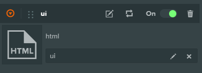
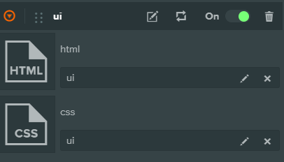
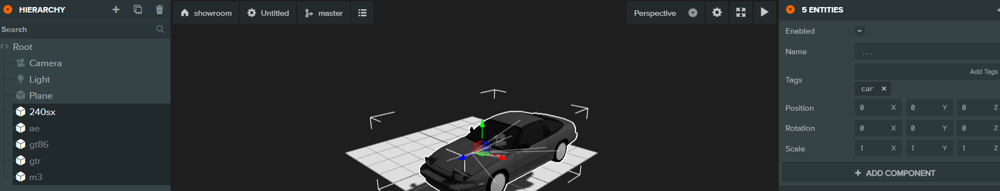
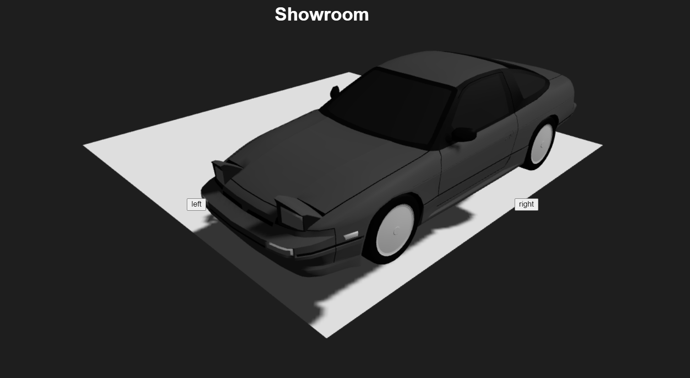

# Część V -  praktyka i przykłady

Rozdział 8

Praktyczny projekt - 

Showroom

Z uwagi na to, że brakuje praktyki w tej książce postanowiłem napisać rozdział z praktycznym projektem, czyli Showroom.

Showroom prezentuje modele 3D samochodów i jest to mały projekt myślę, że jest on ciekawy, okaże się to w trakcie.

Z projektu możesz nauczyć się jak ładować modele 3D jeden po drugim (będzie to łatwiejsze niż implementacja ładowania sceny addytywnie). Zobaczysz też jak doczepić UI z HTML i CSS do twojego showroomu, aby stworzyć interfejs użytkownika.  
Do czego taki showroom może się przydać?   
Pierwsze zastosowanie to wizualizacja.  
Drugie zastosowanie to jako składnik gry wyścigowej, czyli wybór samochodu. W ten sposób możesz przenosić showroom pomiędzy grami / projektami, modyfikując go (np. zmieniając wygląd UI itd.), ale funkcjonalność będzie wciąż podobna. Czyli tak naprawdę twój showroom będzie po prostu reużywalny, bo po co coraz pisać wszystko od nowa prawda? Zapamiętaj ten trick jeżeli planujesz tworzyć więcej projektów niż jeden.

Plan jest taki, tworzysz nowy projekt, starasz się dobrać modele tak, aby rozmiar ich razem nie przekraczał 1GB, jeżeli korzystasz z platformy. 

Jeżeli nie korzystasz z platformy, a w trybie engine-only nie musisz się tak ograniczać. 

W tym przykładzie będę korzystał z platformy.

Zatem czas na praktykę, jak to mówi się po angielsku ‘get your hands dirty’.


<p id="gdcalert68" ><span style="color: red; font-weight: bold">>>>>>  gd2md-html alert: inline image link here (to images/image68.png). Store image on your image server and adjust path/filename/extension if necessary. </span><br>(<a href="#">Back to top</a>)(<a href="#gdcalert69">Next alert</a>)<br><span style="color: red; font-weight: bold">>>>>> </span></p>


W twoim dashboardzie, przejdź do PROJECTS.

Kliknij NEW, aby pokazać okienko z tworzeniem nowego projektu (NEW PROJECT).

Wybierz Blank Project, wpisz nazwę projektu, ja nazwałem to showroom. Możesz dodać

też opcjonalny opis, w tym przypadku jest to nieistotne. Naciskasz CREATE,


<p id="gdcalert69" ><span style="color: red; font-weight: bold">>>>>>  gd2md-html alert: inline image link here (to images/image69.png). Store image on your image server and adjust path/filename/extension if necessary. </span><br>(<a href="#">Back to top</a>)(<a href="#gdcalert70">Next alert</a>)<br><span style="color: red; font-weight: bold">>>>>> </span></p>


przechodzi to dalej do overview twojego projektu, gdzie klikasz EDITOR tak jak na rysunku poniżej (na Watch, Star, Fork nie zwracaj uwagi).


<p id="gdcalert70" ><span style="color: red; font-weight: bold">>>>>>  gd2md-html alert: inline image link here (to images/image70.png). Store image on your image server and adjust path/filename/extension if necessary. </span><br>(<a href="#">Back to top</a>)(<a href="#gdcalert71">Next alert</a>)<br><span style="color: red; font-weight: bold">>>>>> </span></p>


Następny etap to wybór sceny, a w zasadzie tylko kliknięcie na scenę Untitled.


<p id="gdcalert71" ><span style="color: red; font-weight: bold">>>>>>  gd2md-html alert: inline image link here (to images/image71.png). Store image on your image server and adjust path/filename/extension if necessary. </span><br>(<a href="#">Back to top</a>)(<a href="#gdcalert72">Next alert</a>)<br><span style="color: red; font-weight: bold">>>>>> </span></p>


Tak wiem narazie nic ciekawego.

Pokaże się edytor i widok sceny.


<p id="gdcalert72" ><span style="color: red; font-weight: bold">>>>>>  gd2md-html alert: inline image link here (to images/image72.png). Store image on your image server and adjust path/filename/extension if necessary. </span><br>(<a href="#">Back to top</a>)(<a href="#gdcalert73">Next alert</a>)<br><span style="color: red; font-weight: bold">>>>>> </span></p>


Wyrzuć boxa, stwórz folder o nazwie cars, przejdź do niego, zaimportuj swoje modele 3D samochodów do PlayCanvas.

Najedź na ikonkę + przy ASSETS, pokaże się tekst ‘Create or upload new asset’. Kliknij na +, na Upload, wrzuć modele. Gdzie możesz znaleźć modele?

Na BlendSwap, Sketchfab, 3D Warehouse itd., znajdź najlepiej modele w formacie .fbx.

Mała porada nie zaznaczaj wszystkich wybranych modeli do importu, ponieważ będziesz miał bałagan dlatego, że zostaną wrzucone wszystkie materiały obok siebie, z plikami modeli nie byłoby w sumie problemu, no i jeszcze dodatkowo dodać do tego tekstury.

Więc najlepiej stwórz kilka podfolderów w cars, każdy folder dotyczy konkretnego modelu.

Wrzuć po kolei samochody.


<p id="gdcalert73" ><span style="color: red; font-weight: bold">>>>>>  gd2md-html alert: inline image link here (to images/image73.png). Store image on your image server and adjust path/filename/extension if necessary. </span><br>(<a href="#">Back to top</a>)(<a href="#gdcalert74">Next alert</a>)<br><span style="color: red; font-weight: bold">>>>>> </span></p>


Dodaj do hierarchii plik .glb z modelem, zrób tak z pozostałymi modelami. Zostaw włączony jeden model, ukryj pozostałe (odznacz enabled przy entity), uzyskasz taki efekt


Stwórz w folderze głównym folder **ui**, w nim stwórz 3 pliki: ui.js, ui.html, ui.css.

Oddzielę UI od Showroomu.
Najpierw zajmę się ui.js, jak dobrze pamiętasz, aby przygotować HTML do inicjalizacji musisz wpisać taki kod:

```js
this.element = document.createElement('div');
this.element.classList.add('container'); 
document.body.appendChild(this.element);
this.element.innerHTML = this.html.resource;
```

 Cały kod wygląda tak:

```js
/*jshint esversion: 6 */

class Ui extends pc.ScriptType {

    // initialize code called once per entity
    initialize() {
        this.initHTML();
    }
    initHTML(){    
        this.element = document.createElement('div');
        this.element.classList.add('container');
        document.body.appendChild(this.element);
        this.element.innerHTML = this.html.resource;
    
    }

    // update code called every frame
    update(dt) {

    }

}

pc.registerScript(Ui, 'ui');

Ui.attributes.add('html', {type: 'asset', assetType: 'html'});
```

Na pewno zauważyłeś `/*jshint esversion: 6 */` , tak korzystam ze składni ES6.  
Mówiłem wcześniej w jaki sposób wczytać HTML.  
To jeszcze wyjaśnię 2 ostatnie linijki.  

```js
pc.registerScript(Ui, 'ui');
```  
 Oznacza, że rejestrujesz skrypt Ui, musisz tak zrobić jeżeli piszesz w stylu ES6.  
```js
 Ui.attributes.add('html', {type: 'asset', assetType: 'html'});
```  
 W tym miejscu dodajesz definicję zasobu html.  
W PlayCanvas możesz kopiować pliki / zasoby pomiędzy projektami, ja tak zrobię. Po prostu wchodzisz na jeden projekt zaznaczacz zasób dajesz Ctrl+C, przechodzisz do drugiego projektu i Ctrl+V.
Tego nie będę pokazywał.   
Dodaj skrypt ui.js do encji Root, czyli kliknij na Root w hierarchii, Add Component, Script, Add script, ui.js (taka kolejność).
Dodaj zawartość w pliku HTML, np.:
```html
<h1>Showroom</h1>
<button class="left">left</button>
<button class="right">right</button>
```


Gdy dodasz zasób ui.html do skryptu ui.js otrzymasz coś takiego:



Aby podpiąć CSSa w ui.js dodajesz metodę `initCSS()`:

```js
initCSS(){
    const cssRes = this.css.resource;
    const style = pc.createStyle(cssRes);
    document.head.appendChild(style);
        
    style.innerHTML = cssRes;
}
``` 
Wywołujesz ją w `initialize()`:

```js
initialize() {
    this.initHTML();
    this.initCSS();
}
```
Jeszcze na końcu pliku dodajesz taką linijkę:
```js
Ui.attributes.add('css', {type: 'asset', assetType: 'css'});
```

Gdy dodasz zasób ui.css do skryptu ui.js otrzymasz coś takiego:


Wpisałem taki kod CSS:

```css
.container h1 {
    position: absolute;
    color: white;
    left:40%;
}

.left, .right {
    position: absolute;
    top:50%
}

.left{
    left:30%
}
.right{
    right:30%
}

```

Ok, teraz stwórz plik showroom.js i wpisz taki kod:
```js
/*jshint esversion: 6 */

class Showroom extends pc.ScriptType {

    // initialize code called once per entity
    initialize() {
    
    }
    
}

pc.registerScript(Showroom, 'showroom');

```

W tej klasie zrobię metody `hideAll()` oraz `showOne()`:
```js
hideAll(){
    this.cars.forEach(car => car.enabled = false);
}

showOne(index){
    const car = this.cars[index];
    car.enabled = true;
        
    console.log(car.name);
}
```

`hideAll()` ukrywa wszystkie modele.  
`showOne()` pokazuje jeden model, jeszcze dodatkowo wyświetla nazwę samochodu (w celu debug).  


Nadaj wszystkim samochodom tagi 'car' w edytorze, aby po wyszukaniu uzyskać tablicę tych samochodów:

 

Do tego celu skorzystałem z `findByTag()` znajdującego się w Entity i jako argument podałem 'car':
```js
    this.cars = this.app.root.findByTag('car');
```

Szuka to wszystkie samochody z tym tagiem, więc mam tablicę tych encji i mogę w ten sposób ukryć wszystkie modele:
```js
    this.cars.forEach(car => car.enabled = false);
```

Wrócę do klasy Ui. Napisz taką metodę toggleCar():

```js
toggleCar(index){
    this.entity.script.showroom.hideAll();
    const lastIndex = this.entity.script.showroom.cars.length - 1;
    const indexExceedsArray = index < 0 || index > lastIndex;

    if(indexExceedsArray){
        return;
    }
    this.entity.script.showroom.showOne(index);

```
Jak widzisz opakowałem wywoływanie metod `hideAll()` i `showOne()` w jedną metodę `toggleCar()`.  

Dopisz jeszcze taki kod w `initialize()`:

```js
this.initHTML();
this.initCSS();

const left = document.querySelector('.left');
const right = document.querySelector('.right');
let index = 0;

const self = this;
const btnLeft = function(){
    --index;
    console.log('left', index);
    self.toggleCar(index);

};
const btnRight = function(){
    ++index;
    console.log('right', index);

    self.toggleCar(index);

};


left.addEventListener('click', btnLeft);
right.addEventListener('click', btnRight);


```


Zwróć uwagę, że trzeba dać `++index` lub `--index`, a nie `index++` lub `index--` przy zmianie indeksu związanego z kolejnością samochodów.  
Różnicą jest najpierw inkrementacja / dekrementacja, a poźniej przypisanie, od pisania tego w odwrotnej kolejności.

Stosuję tutaj **early return**, aby upewnić się, że indeks jest w zasięgu tablicy.  
Pewnie zwróciłeś też uwagę, że z pozycjami samochodów jest coś nie tak?  
Możesz to poprawić np. w Blenderze, zresetuj każdemu modelowi pozycję na 0,0,0.

Funkcjonalność showroomu jest gotowa. Możesz przełączać pomiędzy samochodami.   
Poniżej efekt twojej pracy (mojej też :) ).  

 


Tak o to zrobiłeś mini projekt, ale czegoś tu brakuje?
Tak, brakuje wyglądu. Zmień styl przycisków left i right. Ustaw inny font w nagłówku Showroom.  


## Rozdział 9  \
  PlayCanvas - przykłady


        Zostaną przeanalizowane dwa techniczne dema, After the Flood i Casino,

szczegółowo kodu nie będę omawiał, bo zajęłoby to z pewnością z kilkaset a może i nawet kilka tysięcy stron, więc poddam analizie demo Casino pod kątem hierarchii (i to bardzo szczegółowo, nie tak pobieżnie jak to było w części o edytorze przy panelu hierarchia),

organizacji zasobów, szczególnie skryptów, ale też pod względem graficznym.

Natomiast ze względu na zbyt dużą złożoność dema After the Flood ograniczę tylko do krótkiej analizy graficznej i skryptów.


### 8.1 After the Flood


<p id="gdcalert74" ><span style="color: red; font-weight: bold">>>>>>  gd2md-html alert: inline image link here (to images/image74.png). Store image on your image server and adjust path/filename/extension if necessary. </span><br>(<a href="#">Back to top</a>)(<a href="#gdcalert75">Next alert</a>)<br><span style="color: red; font-weight: bold">>>>>> </span></p>


**Krótka analiza grafiki i skryptów**

After the Flood to pokaz możliwości WebGL 2 ze współpracą teamu PlayCanvas i Mozilla.

Jak widzisz na rysunku tekstury 3D w postaci proceduralnych chmur stworzone z szumem Worley-Perlin robią wrażenie.

Co zawiera jeszcze to demo?  Zawiera proceduralną wodę, animowane liście z systemem cząsteczek po stronie GPU, renderowanie HDR z antialiasingiem wielopróbkowym (MSAA, multisampling antialiasing), sprzętowe PCF dotyczące cieni, Alpha to coverage, wypalanie mapy świateł w czasie rzeczywistym i odbicia lustrzane.

W przypadku tego projektu kod js nie znajduje się w folderze scripts.

Znalazłem takie pliki js:

 alphaToCoverage.js, ambient.js, assignLight.js, assignLights.js, changeCamera.js, cloth.js, controller.js, debugShaderExplosion.js, demoSettings.js, dontDrawToDepth.js, finalScene.js, finalTempLamp.js, findIdenticalShaders.js, fly-camera.js, foliage.js, fps.js, hideDistance.js, instancingGroup.js, layerSetup.js, leavesParticle.js, leavesShadows.js, less.min.js, loader.js, loading.js, loadShaders.js, makeBrighter.js, mirror.js, namespace.js, noAlphaTest.js, objExportLib.js, opacityFresnel.js, patchCubemap.js, patchFog.js, placeLeaves.js, post2bloom.js, post2colorCorrection.js, post2grabColor.js, postprocess.js, recordShaders.js, reflectableWorld.js, refractiveMaterial.js, renderDebug.js, replaceMipmappedTexture.js, setLayer.js, setNewLayers.js, shaderBuild.js, shaderComplexity.js, shadowCasterControl.js, singleMesh.js, sky.js, skyboxToggle.js, softParticle.js, specularAA.js, subMirror.js, testExample.js, totalTime.js, tree.js, ui.js, volumelight.js, water.js, wire.js, wireUpdate.js, xlimit.js, zprepass.js 

Na poniższej liście opisuje krótko każdy plik js:


1. 
alphaToCoverage - właściwość materiału


2. 
ambient - muzyka ambient


3. 
assignLight, assignLights - przypisanie świateł


4. 
changeCamera - zmień kamerę


5. 
cloth - animacja tkaniny


6. 
controller - kontroler postaci


7. 
debugShaderExplosion - shader eksplozji w trybie debug


8. 
demoSettings - ustawienia technicznego dema


9. 
dontDrawToDepth - nie zezwala na rysowanie do bufora głębi


10. 
finalScene - końcowa scena


11. 
finalTempLamp - końcowa tymczasowa lampa


12. 
findIdenticalShaders - znajduje identyczne shadery z wykorzystaniem odległości edycyjnej


13. 
fly-camera - camera latająca


14. 
foliage - listowie (zbiór liści)


15. 
fps - klatki na sekundę


16. 
hideDistance - ukrywa dystans 


17. 
instancingGroup - grupa instancji potrzebna przy batching


18. 
layerSetup - ustawienia warstwy


19. 
leavesParticle - animowane liście z systemem cząsteczek po stronie GPU


20. 
leavesShadows - cienie liści


21. 
loader  - loader


22. 
loading - ekran wczytywania (loading screen) 


23. 
loadShaders - wczytywanie shaderów


24. 
makeBrighter - rozjaśnia światła uliczne


25. 
mirror - odbicia lustrzane


26. 
namespace - przestrzeń nazw, globalny obiekt atf (after the flood)


27. 
noAlphaTest - brak testu alfa


28. 
objExportLib - biblioteka do eksportu modelu obj


29. 
opacityFresnel - przezroczystość Fresnela (kod nieaktywny)


30. 
patchCubemap -  patch tekstury sześciennej


31. 
patchFog -  patch mgły


32. 
placeLeaves - umieszcza liście dynamicznie


33. 
post2bloom - efekt bloom


34. 
post2colorCorrection - korekcja koloru


35. 
post2grabColor - grab color


36. 
postprocess - postprocessing


37. 
recordShaders - zapis cache shaderów


38. 
reflectableWorld - świat odblaskowy


39. 
refractiveMaterial - refrakcja materiału


40. 
renderDebug - wyświetlanie w trybie debug


41. 
replaceMipmappedTexture - zamienia mipmapowana teksturę


42. 
setLayer - ustawia warstwę


43. 
setNewLayers - ustawia nowe warstwy


44. 
shaderBuild - buduje shader


45. 
shaderComplexity - profile shadera (losowy, postaci, postaci wierzchołków, postaci pikseli, key, czas linkowania shadera)


46. 
shadowCasterControl - kontrola cieni


47. 
singleMesh - łączy siatki (combine mesh), batching


48. 
sky - proceduralne chmury


49. 
skyboxToggle - przełączanie skybox’a


50. 
softParticle -  zmiękczanie systemu cząsteczek


51. 
specularAA - lustrzany antialiasing


52. 
subMirror - ustawienie offsetu głębi lustra


53. 
testExample - przykład testowy


54. 
totalTime - całkowity czas


55. 
tree - instancja drzewa


56. 
ui - interfejs użytkownika, tutaj dynamiczne przełączanie pomiędzy panelami menu, ustawienia, info itd.


57. 
volumelight - światło przestrzenne


58. 
water - proceduralna woda


59. 
wire - drut


60. 
wireUpdate - aktualizacja związana z drutem 


61. 
xlimit - limit pozycji x


62. 
zprepass - dotyczy bufora głębi
Jak widzisz dużo się dzieje w tym demie, dlatego zrezygnowałem z analizy kodu, opisałem tylko pliki js.


### 8.2 Casino


<p id="gdcalert75" ><span style="color: red; font-weight: bold">>>>>>  gd2md-html alert: inline image link here (to images/image75.png). Store image on your image server and adjust path/filename/extension if necessary. </span><br>(<a href="#">Back to top</a>)(<a href="#gdcalert76">Next alert</a>)<br><span style="color: red; font-weight: bold">>>>>> </span></p>


Demo Casino powstało dzięki teamowi PlayCanvas. Jest mniejsze od After the Flood pod względem ilości kodu oraz plików js, więc przeanalizuję jego hierarchię, wspierając się zrzutami ekranowymi. Będę musiał podzielić hierarchię na kilka screenshotów. 

**Analiza hierarchii**

Zacznę od głównych encji, a później będę po kolei rozwijał hierarchię.

Jak się jednak okazuje struktura drzewa jest płaska, jedynie encja cameraPath zawiera encje potomne.


<p id="gdcalert76" ><span style="color: red; font-weight: bold">>>>>>  gd2md-html alert: inline image link here (to images/image76.png). Store image on your image server and adjust path/filename/extension if necessary. </span><br>(<a href="#">Back to top</a>)(<a href="#gdcalert77">Next alert</a>)<br><span style="color: red; font-weight: bold">>>>>> </span></p>


 


<p id="gdcalert77" ><span style="color: red; font-weight: bold">>>>>>  gd2md-html alert: inline image link here (to images/image77.png). Store image on your image server and adjust path/filename/extension if necessary. </span><br>(<a href="#">Back to top</a>)(<a href="#gdcalert78">Next alert</a>)<br><span style="color: red; font-weight: bold">>>>>> </span></p>


<p id="gdcalert78" ><span style="color: red; font-weight: bold">>>>>>  gd2md-html alert: inline image link here (to images/image78.png). Store image on your image server and adjust path/filename/extension if necessary. </span><br>(<a href="#">Back to top</a>)(<a href="#gdcalert79">Next alert</a>)<br><span style="color: red; font-weight: bold">>>>>> </span></p>


<p id="gdcalert79" ><span style="color: red; font-weight: bold">>>>>>  gd2md-html alert: inline image link here (to images/image79.png). Store image on your image server and adjust path/filename/extension if necessary. </span><br>(<a href="#">Back to top</a>)(<a href="#gdcalert80">Next alert</a>)<br><span style="color: red; font-weight: bold">>>>>> </span></p>


<p id="gdcalert80" ><span style="color: red; font-weight: bold">>>>>>  gd2md-html alert: inline image link here (to images/image80.png). Store image on your image server and adjust path/filename/extension if necessary. </span><br>(<a href="#">Back to top</a>)(<a href="#gdcalert81">Next alert</a>)<br><span style="color: red; font-weight: bold">>>>>> </span></p>


Kamery oprócz Camera4 najprawdopodobniej nie są używane.

Jest tu jednak jedna wada, obiekty nie są pogrupowane.

Ogólnie możesz zauważyć tutaj takie encje jak: krzesło barowe, krzesło, stół, drzewo, stół do pokera, światło na drugim piętrze, automat do gier, sofa, bar, odbicia, odbicia automatu do gier, stół do ruletki, poziom szczegółowości LOD (automatu do gier, stołu do ruletki, sofy, stołu do pokera), interfejs użytkownika, efekt glow, ścieżka kamery i inne. Głównych encji naliczyłem 117, jeszcze ścieżka kamery ma 12 encji potomnych co daje w sumie 129 encji w projekcie, czy jest to dużo, mało na pewno nie, dużo też nie. Na tym zakończę analizę hierarchii.

**Analiza zasobów**

Jeśli chodzi o zasoby w projekcie to nie ma ich dużo, więc analiza pójdzie szybko i ograniczę tylko do krótkiego opisu i pokazania modeli 3D.

Folder główny zawiera foldery (scripts, json, materials, models, textures) i pliki (!Cubemap, baseRefl2, ui.html, ui_css.css).

Można w projekcie znaleźć między innymi takie modele 3D jak: krzesło barowe, krzesło, stół, drzewo, stół do pokera, automat do gier, sofa, bar, półka barowa, stół do ruletki, stolik do kawy.


<p id="gdcalert81" ><span style="color: red; font-weight: bold">>>>>>  gd2md-html alert: inline image link here (to images/image81.png). Store image on your image server and adjust path/filename/extension if necessary. </span><br>(<a href="#">Back to top</a>)(<a href="#gdcalert82">Next alert</a>)<br><span style="color: red; font-weight: bold">>>>>> </span></p>


 

_stół do pokera i krzesła_


<p id="gdcalert82" ><span style="color: red; font-weight: bold">>>>>>  gd2md-html alert: inline image link here (to images/image82.png). Store image on your image server and adjust path/filename/extension if necessary. </span><br>(<a href="#">Back to top</a>)(<a href="#gdcalert83">Next alert</a>)<br><span style="color: red; font-weight: bold">>>>>> </span></p>


_automaty do gier_


<p id="gdcalert83" ><span style="color: red; font-weight: bold">>>>>>  gd2md-html alert: inline image link here (to images/image83.png). Store image on your image server and adjust path/filename/extension if necessary. </span><br>(<a href="#">Back to top</a>)(<a href="#gdcalert84">Next alert</a>)<br><span style="color: red; font-weight: bold">>>>>> </span></p>


_stolik do kawy i sofa_


<p id="gdcalert84" ><span style="color: red; font-weight: bold">>>>>>  gd2md-html alert: inline image link here (to images/image84.png). Store image on your image server and adjust path/filename/extension if necessary. </span><br>(<a href="#">Back to top</a>)(<a href="#gdcalert85">Next alert</a>)<br><span style="color: red; font-weight: bold">>>>>> </span></p>


_stół do ruletki_


<p id="gdcalert85" ><span style="color: red; font-weight: bold">>>>>>  gd2md-html alert: inline image link here (to images/image85.png). Store image on your image server and adjust path/filename/extension if necessary. </span><br>(<a href="#">Back to top</a>)(<a href="#gdcalert86">Next alert</a>)<br><span style="color: red; font-weight: bold">>>>>> </span></p>


_bar i półka barowa_

**skrypty**

W projekcie możesz znaleźć następujące skrypty js:

bakeLight.js - wypala światła

Cull.js - culling kamery

distCull.js -  culling odległości

pickReflection.js - wybiera odbicie

animCamera.js - animacja kamery

loadingScreen.js - ekran wczytywania

rotateReflection.js - obraca odbicie

fixGloss.js - naprawia blask

occludeWithLM.js - okluzja z lightmapą (LM - lightmap)

lightProbe.js - próbka światła

lod.js - poziom szczegółów (LOD)

glow.js - efekt glow

flyCamera2.js - kamera latająca

reflectionProbe.js - próbka odbić

overrideLM.js - nadpisuje lightmapę

renderReflection.js - wyświetla odbicia

fog.js - mgła przestrzenna

tileOffsetWorkaround.js - rozwiązanie problemu z offsetem

ui.js - interfejs użytkownika

foliage.js - listowie

dontLod.js - nie aktywuj LOD

cullPrewarm.js - culling

lightProbeAtEachNode.js - próbka światła przy każdym węźle

optimize.js - optymalizacja

bicubicLM.js - lightmapa dwusześcienna

**krótka analiza grafiki**

Demo prezentuje pokaz zastosowania materiałów PBR, o których było wcześniej, mgły przestrzennej, reflection probe, light probe, generowane przez silnik lightmapy, paraboloidalne odbicia w czasie rzeczywistym, poziom szczegółowości modeli 3D LOD.

W demie można przełączyć kamerę pomiędzy kinematyczną, a latającą (można wtedy przeglądać całą scenę). 

To było na tyle odnośnie grafiki.

**Na co zwrócić uwagę?**

Jeszcze jedna sprawa, na co możesz jeszcze zwrócić uwagę, możesz dodać multiplayer / networking w swojej grze, AI np. z biblioteką Yuka [Yuka | A JavaScript library for developing Game AI](https://mugen87.github.io/yuka/), spróbować zintegrować PlayCanvas z Tensorflow.js. Dorzucić Vue albo Reacta, skorzystać z PCUI, libki komponentów UI od PlayCanvas [ PCUI](http://playcanvas.github.io/pcui/).

Możesz jeszcze zbudować z Apache Cordova, aby stworzyć grę mobilną, która będzie aplikacją hybrydową, w ten sposób jesteś w stanie wrzucić na Sklep Google (Google Play) lub Amazon App Store.

Doszedłeś do końca książki, dzięki za przeczytanie jej!

Życzę Ci powodzenia w PlayCanvas, mam nadzieję, że triki które tu opisałem, a było ich parę przydadzą Ci się :)

Jeszcze raz zachęcam do zajrzenia do książki [Physically Based Rendering: From Theory to Implementation](http://www.pbr-book.org/) , możesz też sięgnąć po _Real-Time Rendering, Fourth Edition 4th Edition_ .

 